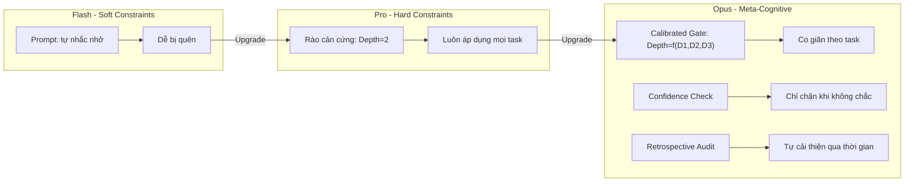

# PLAN (Phần 3): Meta-Cognitive Depth — Opus Perspective

## Mở đầu: Phản biện hai bản trước

Trước khi đề xuất, tôi cần chỉ ra lỗ hổng cốt lõi mà cả Flash lẫn Pro đều mắc phải:

| Chiến lược | Điểm mạnh | Lỗ hổng |
|:-----------|:----------|:--------|
| **Flash** — Soft Constraints (tự nhắc nhở) | Nhẹ nhàng, không tốn overhead | Flash sẽ "quên" lời hứa khi context phình to. Lời khuyên không có cơ chế thực thi. |
| **Pro** — Hard Constraints (rào cản kiến trúc) | Định lượng được, khó bypass | **One-size-fits-all**: Ép Trace Depth = 2 và TDE cho MỌI task, kể cả task D1=1 (sửa typo). Chi phí cố định cao, không co giãn theo độ phức tạp thực tế. |

**Cả hai đều thiếu một lớp quan trọng: khả năng Agent tự đánh giá MÌNH CẦN SUY NGHĨ SÂU ĐẾN MỨC NÀO cho task hiện tại.** Đây chính là Meta-cognition — "tư duy về tư duy".

## BẰNG CHỨNG HỢP LỆ (COMPLIANCE EVIDENCE)
- §C0/§M (Model): D1=5, Model=Claude Opus
- §C1 (Community): Đã search `"meta-cognition" "adaptive depth" LLM agent`. Kết quả:
  - **Metacognitive Prompting (MP)** — ACL Anthology: Ép LLM tự đánh giá độ tin cậy của chính mình trước khi trả lời.
  - **System 1 / System 2 toggling** — emergentmind.com: Module meta-thinking tích hợp tư duy nhanh (heuristic) và tư duy chậm (deliberative), chuyển đổi linh hoạt theo độ khó.
  - **Adaptive Thinking** — Anthropic Claude docs: Model tự quyết định mức sâu khi có tham số `reasoning_effort`.
- §C2 (Scope Lock): `core_protocol.md` (§C2, §C4, §E1), `skills/model_selection/SKILL.md` (D1 scoring).

---

## Đề xuất: 3 lớp Kiến trúc Meta-Cognitive

### Lớp 1: Calibrated Depth Gate (Cổng Hiệu chỉnh Độ sâu) 🔴

**Vấn đề giải quyết:** Pro ép Trace Depth = 2 cho mọi task. Sửa 1 typo cũng phải grep 2 lớp → lãng phí. Sửa kiến trúc lớn chỉ grep 2 lớp → thiếu sâu.

**Giải pháp:** Gắn công thức **Depth tối thiểu = f(D1, D2, D3)** thẳng vào §C2:

| SUM (D1+D2+D3) | Min Trace Depth | Min Hypotheses (§E1) | Cần User Approval? |
|:---:|:---:|:---:|:---:|
| 3–5 | 0 (không cần grep depth) | 1 (fix trực tiếp) | Không |
| 6–8 | 1 (grep callers) | 2 | Mini-plan |
| 9–11 | 2 (grep callers of callers) | 3 | Full plan |
| 12–15 | 3 (grep + dependency map) | 3 + search_web | Full plan + User confirm từng bước |

**Tại sao tốt hơn Pro?** Thay vì con số cứng "Depth = 2", bảng này co giãn theo mức nghiêm trọng thực tế. Task nhỏ thì Agent được chạy nhanh. Task lớn thì Agent bị siết chặt tự động. Không cần User phải nhớ khi nào ép, khi nào thả.

---

### Lớp 2: Confidence-Gated Execution (Thực thi có cổng Confidence) 🔴

**Vấn đề giải quyết:** Cả Flash và Pro đều thiếu cơ chế tự hỏi "Mình có CHẮC không?" trước mỗi bước sửa code. Flash thì nhảy bừa. Pro thì tạo rào cản nhưng không tự đánh giá chất lượng reasoning.

**Giải pháp:** Thêm vào §C4 (Execute) một **Confidence Check bắt buộc** trước mỗi tool call sửa file:

```
PRE-EDIT CONFIDENCE CHECK (Bắt buộc ghi vào task.md hoặc chat):
- Confidence: [HIGH / MEDIUM / LOW]
- Nếu HIGH → Thực thi ngay.
- Nếu MEDIUM → Phải view_file target trước khi sửa (xác nhận line numbers).
- Nếu LOW → DỪNG. Chạy lại §C1 search_web với error message cụ thể 
  HOẶC hỏi User trước khi tiếp.
```

**Tại sao tốt hơn Pro?** "State Reset" của Pro (cấm sửa cùng file ngay) là giải pháp cơ khí — nó chặn mọi trường hợp, kể cả khi Agent ĐÚNG. Confidence Gate chỉ chặn khi Agent THỰC SỰ không chắc, cho phép nó chạy nhanh khi nó biết chắc.

---

### Lớp 3: Retrospective Depth Audit (Kiểm toán Độ sâu hồi cứu)

**Vấn đề giải quyết:** Cả 2 bản trước đều không có cơ chế phản hồi ngược (feedback loop) để cải thiện quy trình qua thời gian. Chúng ta đặt ra Trace Depth nhưng không biết nó có đủ hay thừa cho dự án cụ thể này.

**Giải pháp:** Bổ sung vào §RF1 (Lessons Learned) một câu hỏi bắt buộc:

```
§RF1 — LESSONS LEARNED (bổ sung):
- Depth Audit: Trace Depth thực tế đã dùng = [x]. 
  Có đủ để phát hiện Root Cause ngay lần đầu không? [Y/N]
  Nếu N → Đề xuất tăng Min Trace Depth cho loại task tương tự.
```

**Tại sao quan trọng?** Đây là vòng lặp Kaizen (cải tiến liên tục). Qua 5-10 tasks, Sếp sẽ có dữ liệu thực tế để tinh chỉnh bảng "Calibrated Depth Gate" ở Lớp 1 cho phù hợp với dự án Adobe Illustrator Extensions cụ thể, thay vì dùng con số đoán mò.

---

## So sánh tổng quan 3 bản kế hoạch



## Kế hoạch Xác minh (Verification Plan)

### So sánh trực tiếp
- Sếp đọc 3 file cạnh nhau (`depth_strategy_flash.md`, `depth_strategy_pro.md`, `depth_strategy_opus.md`) để đánh giá chiều sâu tư duy của từng model.

### Triển khai
- Nếu Sếp duyệt, em sẽ nhúng **Bảng Calibrated Depth Gate + Confidence Check + Depth Audit** vào `core_protocol.md` v4.6.
