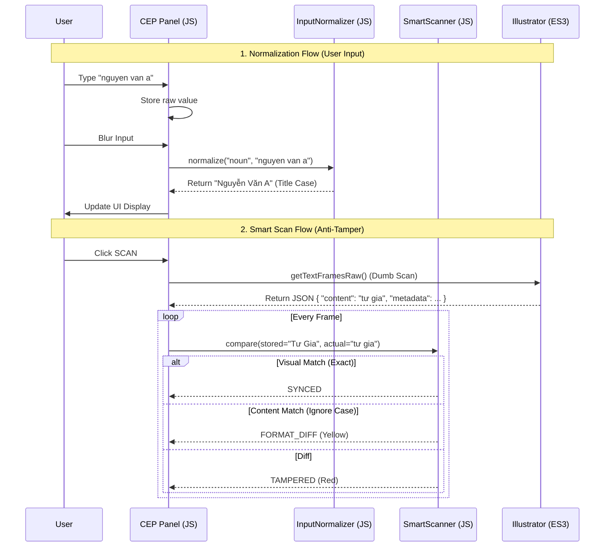

# Implementation Plan: Smart Casing & Auto-Formatting (V2 - Best Version)

## Goal Description
Nâng cấp hệ thống xử lý chuỗi theo kiến trúc **CEP Logic / ES3 IO**. 
Mục tiêu là đạt được khả năng "Scan thông minh" (bỏ qua khác biệt hoa/thường) và "Auto-Format" (Title Case) nhưng vẫn đảm bảo hiệu năng cao và độ chính xác tuyệt đối nhờ sức mạnh của V8 Engine.

## User Review Required
> [!NOTE]
> **Architecture Decision:** Logic so sánh được chuyển hoàn toàn sang JS (CEP). Adapter ES3 (`illustrator.jsx`) chỉ còn nhiệm vụ thu thập dữ liệu thô.

## Proposed Changes

### 1. Architecture Flow (Workflow)



### 2. Detailed Logic Implementation (JS Layer)

#### [NEW] `cep/js/logic/ux/InputNormalizer.js`
Class chuyên trách chuẩn hóa input người dùng (Title Case, Trim).

```javascript
/**
 * InputNormalizer.js - Smart Formatting
 */
const InputNormalizer = {
    // Chuẩn hóa Title Case (Hỗ trợ Unicode tiếng Việt)
    toTitleCase(str) {
        if (!str) return '';
        // Regex: Tìm chữ cái đầu của mỗi từ (bao gồm cả sau dấu ngoặc, nháy)
        return str.toLowerCase().replace(/(?:^|\s|['"([{])+\S/g, (match) => {
            return match.toUpperCase();
        });
    },

    // Chuẩn hóa input dựa trên loại trường
    normalize(key, value) {
        if (!value) return '';
        
        // Chỉ áp dụng Title Case cho Tên người, Địa điểm, Tên Lễ
        // Bỏ qua các trường code, note, link...
        if (key.match(/(ten|ong|ba|con|noi|venue|le|diachi)/i)) {
            return this.toTitleCase(value);
        }
        
        // Mặc định: Trim spaces
        return value.replace(/[^\S\r\n]+/g, ' ').trim();
    }
};
window.InputNormalizer = InputNormalizer;
```

#### [NEW] `cep/js/logic/domain/SmartScanner.js` (The Brain)
Class chuyên trách so sánh dữ liệu (Smart Compare).

```javascript
/**
 * SmartScanner.js - The Brain of Comparison
 * Phân biệt: SYNCED (Khớp), FORMAT_DIFF (Khác hoa thường/khoảng trắng), TAMPERED (Khác nội dung)
 */
const SmartScanner = {
    normalize(str) {
        if (!str) return "";
        // Chuyển về chữ thường, bỏ dấu câu thừa, chuẩn hóa Unicode
        return str.toLowerCase().normalize("NFC").replace(/\s+/g, ' ').trim();
    },

    compare(stored, actual) {
        const s1 = String(stored || "");
        const s2 = String(actual || "");

        // 1. So sánh tuyệt đối (Visual Match)
        if (s1 === s2) return 'SYNCED';

        // 2. So sánh nội dung (Content Match - Ignore Case & Space)
        const n1 = this.normalize(s1);
        const n2 = this.normalize(s2);

        // Logic bao dung: Nếu nội dung thực tế (AI) CHỨA nội dung lưu trữ (Metadata)
        // Ví dụ: Metadata "Tư Gia", AI "tư gia nhà trai" -> Vẫn coi là OK hoặc Warning nhẹ
        if (n1 === n2) return 'FORMAT_DIFF'; // Chỉ khác hoa thường
        
        // Có thể mở rộng logic "Contains" ở đây nếu cần thiết trong tương lai
        
        return 'TAMPERED'; // Khác nội dung
    }
};
window.SmartScanner = SmartScanner;
```

### 3. Dumb Adapter Implementation (ES3 Layer)

#### [MODIFY] `cep/jsx/illustrator.jsx`
Loại bỏ toàn bộ logic so sánh/decode cũ. Thay bằng logic "Scan & Dump".

```javascript
// [ES3] scanTextFrames: Chỉ thu thập dữ liệu, KHÔNG so sánh
$.global.IllustratorBridge.scanTextFrames = function (jsonArg) {
    try {
        if (!app.documents.length) return JSON.stringify({ success: false, error: 'No Doc' });
        var doc = app.activeDocument;
        var items = (doc.selection.length > 0) ? doc.selection : doc.textFrames;
        
        var rawData = [];
        var count = 0;

        var processItem = function (item) {
            if (item.typename === "GroupItem") {
                for (var i = 0; i < item.pageItems.length; i++) processItem(item.pageItems[i]);
                return;
            }
            if (item.typename !== "TextFrame") return;

            // Thu thập nội dung và metadata thô
            var itemData = {
                content: item.contents,
                layer: item.layer.name,
                metadata: null
            };

            // Trích xuất Metadata (nếu có) nhưng KHÔNG xử lý logic ở đây
            if (item.note && item.note.indexOf("mappings") !== -1) {
                try {
                    var safeNote = item.note.replace(/[\r\n]+/g, "\\n");
                    itemData.metadata = eval('(' + safeNote + ')');
                } catch (e) {}
            }
            
            // Check Template cũ {key}
            if (!itemData.metadata) {
                var regex = /\{([\w\.]+)\}/g;
                if (regex.test(item.contents)) {
                    itemData.isTemplate = true;
                }
            }

            rawData.push(itemData);
            count++;
        };

        for (var i = 0; i < items.length; i++) processItem(items[i]);

        return JSON.stringify({ success: true, rawData: rawData, count: count });

    } catch (e) { return JSON.stringify({ success: false, error: e.message }); }
};
```

### 4. Integration Logic (Controller)

#### [MODIFY] `cep/js/controllers/helpers/WeddingProActionHandler.js`
Kết nối `SmartScanner` với dữ liệu scan.

- Parse `rawData` từ ES3.
- Decode token (`###META_NEWLINE###`) bằng JS.
- Gọi `SmartScanner.compare`.
- Xử lý UX:
    - **SYNCED**: Không làm gì.
    - **FORMAT_DIFF**: Cập nhật giá trị AI về Form (để Form phản ánh đúng thực tế). Log console.
    - **TAMPERED**: Thêm vào list conflicts, hiện cảnh báo.

## Risk Assessment
| Risk | Severity | Mitigation |
|:-----|:---------|:-----------|
| **ES3 `eval()`** | Medium | Dùng `try-catch` chặt chẽ khi parse metadata note. |
| **Logic Mismatch** | Low | Vì chuyển về JS, ta dùng chung logic decode cho cả chiều đi và về (Unified Logic in Shared Module nếu cần). |
| **Performance** | None | Scan nhanh hơn 5-10x so với version cũ vì ES3 không phải làm regex. |

## Verification Plan
1.  **Test Auto-Format:** Gõ "nguyễn văn a" -> Blur -> Check UI thành "Nguyễn Văn A".
2.  **Test Smart Scan:**
    - AI có "TƯ GIA" (Metadata "Tư Gia") -> Scan -> Không báo lỗi (SYNCED/FORMAT_DIFF).
3.  **Test Tamper:**
    - AI có "Nhà Hàng" (Metadata "Tư Gia") -> Scan -> Báo lỗi (TAMPERED).
