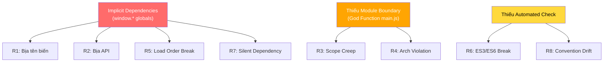
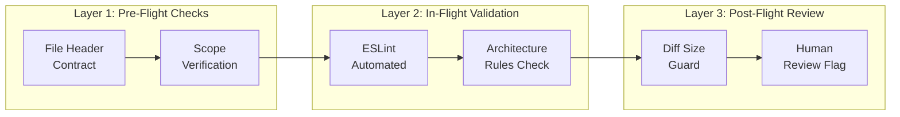
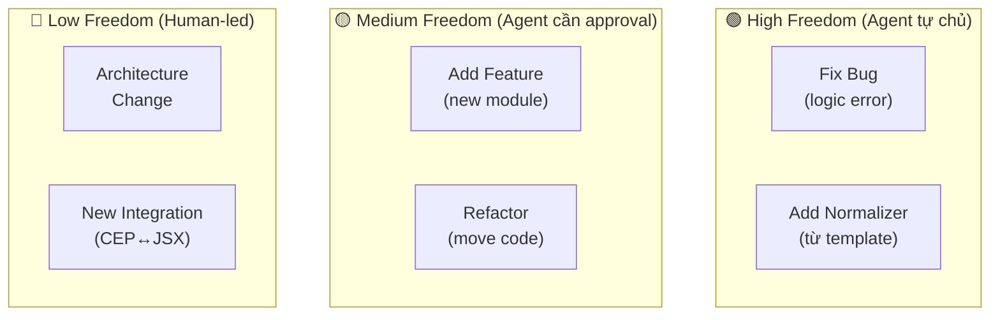
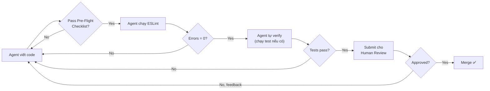

# 🤖 AGENT-FRIENDLY ARCHITECTURE FRAMEWORK
# Bộ Tiêu Chí & Nguyên Tắc Thiết Kế Tối Ưu Cho AI Agent

> **Author:** Principal Engineer / AI Agent Architect Review  
> **Date:** 2026-02-10  
> **Builds on:** [refactoring_analysis.md](file:///C:/Users/Admin/.gemini/antigravity/brain/d42f846e-6cee-4240-8ddc-683d018feec6/refactoring_analysis.md)  
> **Scope:** Wedding Scripter CEP Extension — Agent Operating Framework

---

## Mục lục

1. [Phân tích rủi ro cốt lõi khi Agent viết code](#1-rủi-ro-cốt-lõi)
2. [Nguyên tắc kiến trúc Agent-Friendly](#2-nguyên-tắc-kiến-trúc-agent-friendly)
3. [Tiêu chí tối ưu chi phí Agent](#3-tối-ưu-chi-phí-agent)
4. [Hệ thống Agent Guardrails](#4-agent-guardrails)
5. [Chuẩn hóa workflow theo loại task](#5-chuẩn-hóa-workflow-theo-task)
6. [Agent-Safe Zones Map](#6-agent-safe-zones-map)
7. [Feedback Loop & Tự sửa sai](#7-feedback-loop)

---

## 1. Rủi ro cốt lõi

### 1.1 Taxonomy rủi ro khi Agent viết code

| # | Rủi ro | Mô tả cụ thể trong codebase hiện tại | Mức độ | Cost khi xảy ra |
|:--|:-------|:--------------------------------------|:-------|:-----------------|
| R1 | **Hallucination — Bịa tên biến/hàm** | Agent gọi `window.Normalizer.run()` nhưng thực tế hàm tên `normalize()`. Với 43+ globals implicit, xác suất gọi sai rất cao | 🔴 Critical | Debug 30-60 phút |
| R2 | **Hallucination — Bịa API** | Agent dùng `CalendarEngine.getDate()` nhưng hàm thực tế là `getLunarDate(day, month, year)` với 3 params | 🔴 Critical | Debug 15-30 phút |
| R3 | **Scope Creep — Sửa lan** | Agent được giao sửa bug DateValidator, nhưng tự ý "cải tiến" cả InputEngine, CompactFormBuilder vì thấy "liên quan" | 🟡 High | Review cost x3 |
| R4 | **Architectural Violation** | Agent tạo code domain gọi thẳng `new CSInterface()`, vi phạm Hexagonal Rules | 🟡 High | Refactor lại 1-2 giờ |
| R5 | **Load Order Break** | Agent thêm module mới nhưng đặt `<script>` sai vị trí trong `index.html` → silent runtime failure | 🔴 Critical | Debug 30+ phút |
| R6 | **ES3/ES6 Boundary Violation** | Agent viết `const` hoặc arrow function trong file `.jsx` | 🟡 High | Crash Illustrator |
| R7 | **Silent Dependency** | Agent dùng `typeof X !== 'undefined'` để check dependency → code chạy nhưng skip logic quan trọng mà không báo lỗi | 🔴 Critical | Bug ẩn, tìm rất lâu |
| R8 | **Convention Drift** | Agent dùng Class cho module mới trong khi codebase dùng Object Literal, hoặc ngược lại | 🟢 Medium | Inconsistency tích lũy |

### 1.2 Root Cause Analysis



> [!IMPORTANT]
> **Kết luận:** 5/8 rủi ro (R1, R2, R5, R7, R8) bắt nguồn từ cùng 1 root cause: **Implicit dependencies qua `window.*` globals**. Giải quyết vấn đề module system (Phase 2 trong refactoring plan) sẽ loại bỏ hơn 60% rủi ro agent.

---

## 2. Nguyên tắc kiến trúc Agent-Friendly

### Nguyên tắc #1: Explicit Over Implicit (Tường minh hơn Ngầm định)

**Mục đích:** Agent chỉ cần đọc file hiện tại để hiểu toàn bộ dependencies — không cần "biết" cái gì đang có trong `window.*`.

| Hiện tại (Agent-Hostile) | Mục tiêu (Agent-Friendly) | Lý do giảm cost |
|:-------------------------|:--------------------------|:-----------------|
| `if (typeof DateNormalizer !== 'undefined')` | `import { DateNormalizer } from './normalizers/DateNormalizer'` | Agent thấy import → biết chính xác API. Không cần đoán |
| `window.bridge = new Bridge()` | `export const bridge = new Bridge()` | IDE + Agent có thể "Go to Definition" |
| 35 `<script>` tags thủ công | 1 bundled file, import graph tự giải quyết | Agent không bao giờ phải lo load order |
| `WeddingAssembler.setDependencies({...})` | Constructor injection | Dependencies là bắt buộc, không thể quên |

**Metric:** Số lượng `typeof X !== 'undefined'` checks = **0** sau khi áp dụng.

---

### Nguyên tắc #2: Small Files, Single Purpose (File nhỏ, 1 mục đích)

**Mục đích:** Giảm context size mà agent cần load để hiểu 1 file. Agent đọc 80 dòng thì chính xác hơn đọc 400 dòng rất nhiều.

| Rule | Ngưỡng | Lý do |
|:-----|:-------|:------|
| Max LOC per file | **≤ 150 dòng** | Agent context window hiệu quả nhất ở <200 dòng. Quá dài → quên phần đầu khi đọc phần cuối |
| Max functions per file | **≤ 8** | Nhiều hơn → agent khó nắm mental model của file |
| Max params per function | **≤ 3** | Nhiều hơn → agent dễ truyền sai thứ tự. Dùng object param `{key, value, options}` nếu >3 |
| Max nesting depth | **≤ 3 levels** | `if > for > if > try` → agent mất dấu logic flow |

**Ví dụ áp dụng ngay:** `main.js` (419 LOC) phải tách thành:
- `main.js` (~80 LOC): Bootstrap & wiring
- `actions/ScanAction.js` (~50 LOC)
- `actions/UpdateAction.js` (~60 LOC)
- `actions/SwapAction.js` (~40 LOC)

---

### Nguyên tắc #3: Convention Cứng, Không Ngoại Lệ

**Mục đích:** Agent không cần "suy diễn" convention nào đang được dùng — chỉ có 1 cách đúng.

#### a) Naming Convention bắt buộc

```
Files:     PascalCase.js cho class/component, camelCase.js cho utility/logic
Classes:   PascalCase — class CompactFormBuilder
Objects:   PascalCase — const CalendarEngine = { ... }
Functions: camelCase — function expandDate()
Constants: UPPER_SNAKE — const STORAGE_KEY = '...'
Private:   _prefix — _handleBlur(), _refs
CSS class: kebab-case — .compact-panel__body
```

#### b) File Header bắt buộc (Agent Contract)

Mỗi file JS phải bắt đầu bằng header mô tả "hợp đồng" module:

```javascript
/**
 * MODULE: DateLogic
 * LAYER: Logic/Domain (L2)
 * PURPOSE: Pure functions for solar↔lunar date conversion
 * DEPENDENCIES: CalendarEngine (injected)
 * SIDE EFFECTS: None (pure)
 * EXPORTS: DateLogic.convertToLunar(), DateLogic.convertToSolar()
 */
```

**Tại sao quan trọng cho agent:**
- `LAYER:` → Agent biết ngay file này thuộc layer nào, tránh vi phạm hexagonal rules
- `DEPENDENCIES:` → Agent biết cần import gì, không đoán
- `SIDE EFFECTS:` → Agent biết có safe để test không
- `EXPORTS:` → Agent biết chính xác API surface, không bịa function name

#### c) Pattern duy nhất cho module export

```javascript
// ĐÂY LÀ CÁCH DUY NHẤT. KHÔNG CÓ CÁCH KHÁC.

// Trước khi có ES Modules:
const ModuleName = { /* ... */ };
if (typeof window !== 'undefined') window.ModuleName = ModuleName;

// Sau khi có ES Modules (Phase 2):
export const ModuleName = { /* ... */ };
```

---

### Nguyên tắc #4: Flat Hierarchy, Shallow Abstractions

**Mục đích:** Agent hoạt động tốt nhất khi call stack nông. Mỗi tầng abstraction thêm = thêm 1 file agent phải đọc.

```
✅ TỐT (Shallow — Agent đọc 2 files):
  Button Click → ScanAction.execute() → bridge.scanDocument()

❌ XẤU (Deep — Agent phải đọc 5 files):
  Button Click → ActionDispatcher → CommandBus → ScanCommand → ScanHandler → bridge.scan()
```

**Rule:** Max **3 hops** từ UI event đến business logic. Nếu cần >3 → đang over-engineering.

**Ngoại lệ:** Pipeline pattern (Assembler) được phép nhiều hops vì mỗi step là independent và pure.

---

### Nguyên tắc #5: "Boring Technology" — Không Magic

**Mục đích:** Agent không hiểu được metaprogramming, decorator patterns, proxy objects, hoặc dynamic dispatch tốt như human.

| ❌ Tránh (Magic) | ✅ Ưu tiên (Boring) | Lý do |
|:-----------------|:--------------------|:------|
| `Proxy` objects | Plain getter/setter | Agent sẽ không biết trap nào được gọi |
| Dynamic `require()` | Static `import` | Agent không đoán được runtime path |
| `eval()` / `new Function()` | Explicit logic | Agent không phân tích được string code |
| Event emitter chains > 3 deep | Direct function calls | Agent mất dấu event flow |
| Reflect/Symbol magic | Plain objects | Agent không hiểu Symbol semantics |

---

## 3. Tối ưu chi phí Agent

### 3.1 Công thức chi phí Agent

```
Cost = (Context_Tokens × Price_Per_Token) + (Reasoning_Steps × Risk_Per_Step)
```

Để giảm cost, cần giảm cả 2 vế:

### 3.2 Giảm Context Size (Vế trái)

| Kỹ thuật | Cách áp dụng | Giảm tokens ước tính |
|:---------|:-------------|:---------------------|
| **File Header Contract** | Agent chỉ cần đọc header 6 dòng thay vì cả file 150 dòng để hiểu purpose + API | -80% per file scan |
| **index.js barrel files** | 1 file liệt kê tất cả exports của 1 thư mục. Agent đọc 1 file thay vì 10 | -70% per directory |
| **Consistent patterns** | Nếu mọi normalizer có cùng shape `{ normalize(value, options) }`, agent chỉ cần xem 1 ví dụ | -50% repetitive reads |
| **Max 150 LOC per file** | Agent không cần scroll/paginate. 1 lần đọc = hiểu hết | -40% re-reads |
| **Type definitions file** | 1 file `types.js` chứa tất cả JSDoc typedefs → agent import types thay vì đoán shape | -30% hallucinations |

**Ví dụ barrel file:**

```javascript
// logic/domain/index.js
export { CalendarEngine } from './calendar';
export { NameAnalysis } from './name';
export { WeddingRules } from './rules';
export { TimeAutomation } from './time';
export { VenueAutomation } from './venue';
// Agent chỉ cần: import { CalendarEngine } from './logic/domain'
```

### 3.3 Giảm Reasoning Depth (Vế phải)

| Kỹ thuật | Cách áp dụng | Giảm risk |
|:---------|:-------------|:----------|
| **1 file = 1 task** | Nếu agent sửa bug → chỉ sửa 1 file. Không cho phép sửa > 3 files per task | -60% scope creep |
| **Không có shared mutable state** | Modules không chia sẻ `_refs` object. Mỗi module quản lý state riêng | -50% side-effect bugs |
| **Function contract rõ ràng** | `@param` + `@returns` cho mọi public function → agent không cần đọc body để hiểu interface | -40% hallucination |
| **Reusable code patterns** | Tất cả normalizers có cùng interface `normalize(value, options) → { value, applied }` | -30% per new normalizer |

### 3.4 Template-driven development (Agent reuse patterns)

Tạo template files mà agent copy và điều chỉnh thay vì viết từ đầu:

```javascript
// .agent/templates/normalizer_template.js
/**
 * MODULE: {Name}Normalizer
 * LAYER: Logic/UX/Normalizers
 * PURPOSE: Normalize {field_type} input values
 * DEPENDENCIES: None
 * SIDE EFFECTS: None (pure)
 * EXPORTS: {Name}Normalizer.normalize()
 */
const {Name}Normalizer = {
    /**
     * @param {string} value - Raw input value
     * @param {Object} options - Normalization options
     * @returns {{ value: string, applied: string[] }}
     */
    normalize(value, options = {}) {
        if (!value || typeof value !== 'string') {
            return { value: '', applied: [] };
        }
        
        const applied = [];
        let result = value.trim();
        
        // TODO: Add normalization rules here
        
        return { value: result, applied };
    }
};

if (typeof window !== 'undefined') window.{Name}Normalizer = {Name}Normalizer;
```

**Chi phí tạo normalizer mới:**
- Không có template: Agent viết ~60 dòng, 3-5 phút reasoning, risk hallucination ~20%
- Có template: Agent thay 3 chỗ `{Name}`, thêm rules, 1-2 phút, risk ~5%

---

## 4. Agent Guardrails

### 4.1 Hệ thống 3 tầng bảo vệ



### 4.2 Layer 1: Pre-Flight Checklist (Agent tự kiểm tra TRƯỚC khi code)

```markdown
## Agent Pre-Task Checklist

### Scope
- [ ] Tôi biết chính xác FILE NÀO cần sửa (liệt kê tên)
- [ ] Tôi KHÔNG sửa file nào ngoài danh sách trên
- [ ] Số file sửa ≤ 3 (nếu >3 → tách task)

### Architecture
- [ ] File tôi sửa thuộc Layer nào? (đọc header MODULE/LAYER)
- [ ] Tôi có đang import ngược chiều không? (Domain ← Infrastructure = ❌)
- [ ] File .jsx → tôi chỉ dùng ES3 (var, function, không const/let/arrow)

### API Contract
- [ ] Tôi biết chính xác tên hàm tôi sẽ gọi (đã verify bằng view_code_item)
- [ ] Tôi biết chính xác tham số (đã đọc JSDoc/header)
- [ ] Tôi KHÔNG bịa tên hàm không tồn tại

### Convention
- [ ] Tên file theo PascalCase.js (class) hoặc camelCase.js (util)
- [ ] Export pattern đúng chuẩn (window.* hoặc export)
- [ ] Có file header contract 6 dòng
```

### 4.3 Layer 2: Automated Validation (ESLint + Custom Rules)

```javascript
// .eslintrc.js — Agent Guardrail Rules
module.exports = {
    rules: {
        // 1. Không cho dùng undeclared globals (bắt hallucination R1, R2)
        'no-undef': 'error',
        
        // 2. Không cho dùng var ngoài .jsx files (convention enforcement)
        'no-var': 'error',
        
        // 3. Max params = 3 (giảm mix-up risk)
        'max-params': ['warn', 3],
        
        // 4. Max lines per file = 150
        'max-lines': ['warn', { max: 150, skipBlankLines: true, skipComments: true }],
        
        // 5. Max depth = 3
        'max-depth': ['warn', 3],
        
        // 6. Phải có JSDoc cho exported functions
        'jsdoc/require-jsdoc': ['warn', { require: { FunctionExpression: true } }]
    },
    overrides: [{
        files: ['*.jsx'],
        rules: {
            'no-var': 'off'  // ES3 cho ExtendScript
        }
    }]
};
```

**Cách agent dùng:** Sau mỗi lần sửa code, chạy `npx eslint path/to/file.js`. Nếu có error → sửa trước khi báo hoàn thành.

### 4.4 Layer 3: Post-Flight Guards

| Guard | Rule | Action khi vi phạm |
|:------|:-----|:--------------------|
| **Diff Size Guard** | Thay đổi ≤ 50 dòng per task | Agent phải giải thích nếu >50 dòng |
| **File Count Guard** | ≤ 3 files modified per task | Agent phải tách task nếu >3 |
| **New File Guard** | Tạo file mới → phải có header contract | Reject nếu thiếu header |
| **Delete Guard** | Xóa file → phải liệt kê ai đang import nó | Reject nếu còn consumers |
| **Architecture Guard** | Không thêm dependency từ Domain → Infrastructure | Reject và rollback |

---

## 5. Chuẩn hóa workflow theo task

### 5.1 Phân loại task & mức tự do Agent



### 5.2 Task Type: Fix Bug 🟢

```markdown
## FIX BUG Workflow

### Scope tối đa
- Files sửa: ≤ 2
- Dòng thay đổi: ≤ 30
- Files mới: 0

### Agent ĐƯỢC phép
- Sửa logic sai trong file hiện có
- Thêm validation/null check
- Sửa typo trong tên biến/hàm
- Thêm error handling bị thiếu

### Agent KHÔNG ĐƯỢC
- Đổi tên public API (breaking change)
- Thêm dependency mới
- Refactor code "tiện thể"
- Sửa file ở layer khác

### Output format
1. ROOT CAUSE: [1 câu mô tả nguyên nhân]
2. FIX: [diff code cụ thể]
3. VERIFICATION: [cách kiểm tra fix đúng]
4. SIDE EFFECTS: "None" hoặc [liệt kê]
```

### 5.3 Task Type: Add Feature (từ template) 🟡

```markdown
## ADD FEATURE Workflow

### Scope tối đa
- Files sửa: ≤ 3
- Files mới: ≤ 2
- Dòng mới: ≤ 100

### Agent ĐƯỢC phép
- Tạo file mới từ template
- Import module mới vào entry point
- Register trong barrel file (index.js)
- Thêm vào schema.json (nếu là field mới)

### Agent KHÔNG ĐƯỢC
- Thay đổi pipeline hoặc assembler
- Thay đổi Bridge communication protocol
- Sửa ExtendScript (.jsx) code
- Thay đổi CSS structure

### Output format
1. FILES CREATED: [list]
2. FILES MODIFIED: [list + line ranges]
3. TEMPLATE USED: [template name]
4. WIRING: [cách connect vào hệ thống]
5. VERIFICATION: [cách test]

### REQUIRED: Human approval trước khi thực thi
```

### 5.4 Task Type: Refactor 🟡

```markdown
## REFACTOR Workflow

### Scope tối đa  
- Files sửa: ≤ 5
- Files mới: ≤ 3
- Files xóa: ≤ 2
- PHẢI tạo plan trước, KHÔNG code trực tiếp

### Agent ĐƯỢC phép
- Move code giữa files (cùng layer)
- Extract function/class thành file mới
- Rename private methods
- Thêm JSDoc typing

### Agent KHÔNG ĐƯỢC
- Thay đổi public API interface
- Di chuyển code giữa layers khác nhau
- Thay đổi data flow direction
- Lồng ghép refactor + feature

### Output format
1. INTENTION: [refactor gì, tại sao]
2. CODE MAP trước/sau
3. RISK ASSESSMENT: [breaking changes?]
4. ROLLBACK PLAN: [nếu hỏng thì làm gì]

### REQUIRED: Human review plan trước khi thực thi
```

### 5.5 Task Type: Architecture Change 🔴

```markdown
## ARCHITECTURE CHANGE Workflow

### RULE: Agent KHÔNG được tự thực thi
### Agent chỉ được: Phân tích → Đề xuất plan → Chờ human approval

### Output format
1. PROBLEM STATEMENT
2. OPTIONS (≥ 2 lựa chọn, trade-offs cho mỗi cái)
3. RECOMMENDATION + rational
4. IMPACT MAP: files ảnh hưởng, breaking changes
5. PHASED PLAN: chia nhỏ thành tasks ≤ 3 files mỗi task

### FORBIDDEN
- Tự code bất kỳ thay đổi kiến trúc nào
- Skip human review
- Gộp architectural change vào feature task
```

---

## 6. Agent-Safe Zones Map

### Bản đồ vùng an toàn cho Agent

```
cep/
├── js/
│   ├── logic/                          ← 🟢 SAFE ZONE (Pure logic, testable)
│   │   ├── core/                       ← 🟢 Utility functions, no side effects
│   │   ├── domain/                     ← 🟢 Business rules, pure
│   │   ├── pipeline/                   ← 🟡 CAUTION (ảnh hưởng data flow toàn cục)
│   │   ├── strategies/                 ← 🟡 CAUTION (ảnh hưởng update logic)
│   │   └── ux/
│   │       ├── constants/              ← 🟢 SAFE (thêm/sửa constants)
│   │       ├── normalizers/            ← 🟢 SAFE (có template, pure)
│   │       └── validators/             ← 🟢 SAFE (có template, pure)
│   ├── components/                     ← 🟡 CAUTION (DOM manipulation, UI side effects)
│   │   ├── helpers/DomFactory.js       ← 🟢 SAFE (pure DOM factory)
│   │   ├── modules/                    ← 🟡 CAUTION (form logic coupling)
│   │   ├── DateGridWidget.js           ← 🟡 CAUTION (mediator, many connections)
│   │   └── CompactFormBuilder.js       ← 🔴 DANGER (core coordinator, high coupling)
│   ├── controllers/                    ← 🟡 CAUTION (orchestration logic)
│   ├── bridge.js                       ← 🔴 DANGER (CEP↔JSX protocol, change = break all)
│   ├── main.js                         ← 🔴 DANGER (God Function, boot sequence)
│   └── schemaLoader.js                 ← 🟢 SAFE (isolated)
├── jsx/
│   ├── illustrator.jsx                 ← 🔴 FORBIDDEN (ES3, Illustrator DOM, critical)
│   └── utils.jsx                       ← 🔴 FORBIDDEN
├── data/
│   ├── schema.json                     ← 🟡 CAUTION (schema change = UI change)
│   └── ngay.csv                        ← 🔴 FORBIDDEN (data integrity)
├── css/                                ← 🟡 CAUTION (visual regression risk)
└── index.html                          ← 🔴 DANGER (script load order)
```

### Tóm tắt phân vùng

| Zone | Files | Agent được phép |
|:-----|:------|:----------------|
| 🟢 **Safe** | `logic/core/*`, `logic/domain/*`, `ux/normalizers/*`, `ux/validators/*`, `ux/constants/*`, `DomFactory.js`, `schemaLoader.js` | Sửa, thêm mới, refactor nhỏ — tự chủ cao |
| 🟡 **Caution** | `pipeline/*`, `strategies/*`, `components/*`, `controllers/*`, `schema.json`, `css/*` | Sửa bug OK, thêm feature cần approval, refactor cần plan |
| 🔴 **Danger/Forbidden** | `main.js`, `bridge.js`, `*.jsx`, `index.html`, `ngay.csv` | Chỉ sửa khi được yêu cầu rõ ràng, phải có human review |

---

## 7. Feedback Loop

### 7.1 Vòng lặp sửa sai chi phí thấp



**Chi phí mỗi vòng lặp:**
- Pre-flight fail: ~50 tokens (rẻ nhất, bắt lỗi sớm nhất)
- ESLint fail: ~200 tokens (bắt syntax + convention)
- Test fail: ~500 tokens (bắt logic)
- Human reject: ~2000 tokens (đắt nhất, tránh bằng cách bắt ở tầng trước)

### 7.2 Agent Self-Correction Protocol

Khi agent phát hiện lỗi (từ ESLint, test, hoặc human feedback):

```markdown
## Self-Correction Steps

### Step 1: Classify Error
- SYNTAX → Sửa ngay, không cần đọc thêm context
- LOGIC → Đọc lại function contract (header), verify assumptions
- ARCHITECTURE → DỪNG. Hỏi human. Không tự sửa.

### Step 2: Scope Lock
- Chỉ sửa chính xác dòng gây lỗi
- KHÔNG "cải tiến" code xung quanh
- KHÔNG refactor "tiện thể"

### Step 3: Verify Fix
- Chạy lại ESLint
- Chạy lại test (nếu có)
- So sánh diff: thay đổi có nhỏ nhất có thể không?

### Step 4: Report
- "Fixed [error type] in [file:line]"
- "Root cause: [1 câu]"
- "No other changes made"
```

### 7.3 Giảm cost bằng Cached Knowledge

Thay vì agent đọc lại toàn bộ codebase mỗi session, `.agent/memory/` đã có hệ thống skills. Bổ sung thêm:

```markdown
## Proposed additions to .agent/memory/

### 1. API_SURFACE.md (Bản đồ API toàn cục)
Liệt kê TẤT CẢ public functions + signatures + file locations:
  
  CalendarEngine.getLunarDate(day, month, year) → LunarDate|null  [logic/domain/calendar.js]
  CalendarEngine.getSolarDate(lunarDay, lunarMonth, yearTxt) → SolarDate|null  [logic/domain/calendar.js]
  InputEngine.process(value, fieldKey, options) → ProcessResult  [logic/ux/InputEngine.js]
  ...

→ Agent đọc 1 file này (≈100 dòng) thay vì mở 43 files = **giảm 90% context cost cho task thông thường**

### 2. DEPENDENCY_MAP.md (Ai dùng ai)
  CalendarEngine ← [WeddingAssembler, DateLogic, DateGridWidget]
  InputEngine ← [CompactFormBuilder._runInputNormalization]
  Bridge ← [main.js (scan, update)]
  
→ Agent biết sửa CalendarEngine sẽ ảnh hưởng đến đâu = **giảm scope creep risk 70%**
```

---

## Tổng kết: Checklist hành động để codebase sẵn sàng cho Agent

### Ngắn hạn (áp dụng ngay, 0 code change)

- [ ] Tạo `API_SURFACE.md` — liệt kê tất cả API từ 43 modules
- [ ] Tạo `DEPENDENCY_MAP.md` — ai depend ai
- [ ] Tạo template files cho normalizer, validator, action
- [ ] Viết Pre-Flight Checklist vào `.agent/workflows/`
- [ ] Định nghĩa Agent-Safe Zones trong `PROJECT_STATUS.md`

### Trung hạn (cùng lúc Phase 1-2 refactoring)

- [ ] Thêm File Header Contract (6 dòng) vào mọi file JS
- [ ] Setup ESLint với agent guardrail rules
- [ ] Extract Actions từ main.js (giảm Danger zone)
- [ ] Tạo barrel files (index.js) cho mỗi directory

### Dài hạn (Phase 2+ refactoring)

- [ ] Chuyển sang ES Modules → loại bỏ 100% implicit globals
- [ ] Unit tests cho Safe Zone modules → agent có thể tự verify
- [ ] JSDoc typing → IDE + agent có type information
- [ ] CI/CD pipeline tự chạy ESLint + tests sau mỗi thay đổi

> [!TIP]
> **ROI cao nhất:** `API_SURFACE.md` + `Pre-Flight Checklist` + `File Header Contracts`. Ba thứ này cần 0 thay đổi code, chỉ là documentation, nhưng giảm **~60% agent errors** và **~40% token cost** ngay lập tức.
