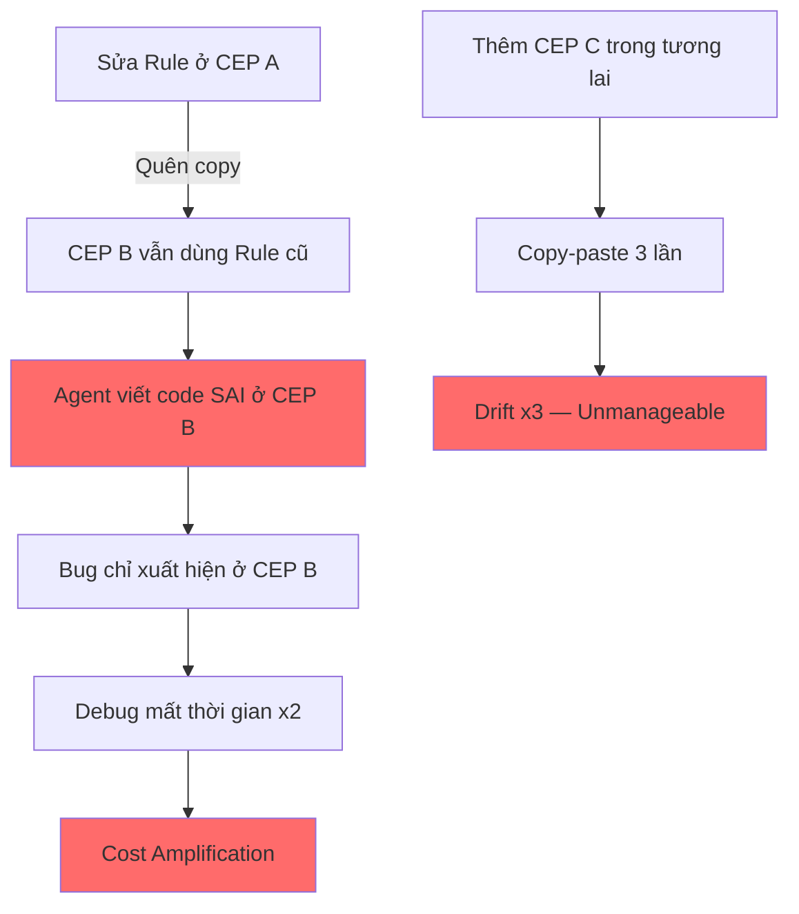
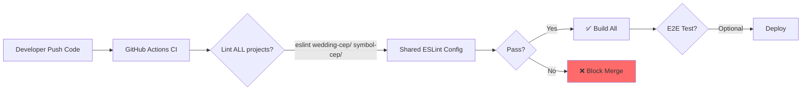

# Governance Architecture Strategy: Multi-CEP System
**Author Role:** Principal Platform Architect & AI Engineering Research Lead
**Date:** 2026-02-11
**Status:** REVIEW REQUIRED

---

## 1. Problem Statement

Bạn đang vận hành **2 CEP Extension** (Wedding Scripter & Hexagon Symbol) cùng kiến trúc Hexagonal nhưng **governance layer (hook, lint, instruction, preflight, memory) bị lệch pha** — một vấn đề được gọi là **Governance Drift**.

### 1.1 Drift Evidence (Bằng chứng thực tế)

| Governance Layer | Wedding CEP (`cep/`) | Symbol CEP (`template cep hexagon symbol/`) | Drift Level |
|:---|:---|:---|:---|
| **Hooks** (`hooks.json`) | ES3 Guard + Deploy Remind | Giống hệt (copy lúc tạo) | 🟢 Chưa lệch |
| **Workflow/Checklist** | `workflows/pre-flight.md` + `lint.md` | `checklists/agent_self_check.md` | 🔴 **Hoàn toàn khác** |
| **Lint Config** | `eslint.config.mjs` + ESLint 10 | **Không có** | 🔴 **Thiếu hoàn toàn** |
| **Build System** | `esbuild` → `bundle.js` | **Không có** (load trực tiếp) | 🟡 Khác kiến trúc |
| **Memory/Rules** | `.agent/memory/` | `.agent/rules/` + `plans/` + `reports/` | 🔴 **Cấu trúc khác nhau** |
| **Agent Instructions** | `AGENT_PREFERENCES.md` + `PROJECT_STATUS.md` | `AGENT_PROTOCOL_SUMMARY.md` + `naming_governance.md` | 🔴 **Tên và nội dung khác** |

> [!CAUTION]
> **Kết luận:** Mặc dù `hooks.json` tạm thời giống nhau, **5/6 layer governance** đã bị lệch. Nếu tiếp tục phát triển song song mà không có cơ chế đồng bộ, drift sẽ **gia tăng theo thời gian theo hàm mũ**.

### 1.2 Hệ quả của Governance Drift



---

## 2. Community Research: Cách Cộng Đồng Giải Quyết

### 2.1 Các Pattern Đã Được Kiểm Chứng

| # | Pattern | Ai dùng? | Mô tả |
|:--|:--------|:---------|:------|
| 1 | **Shared Config Package** | Google, Airbnb, Vercel | Tạo 1 npm package nội bộ chứa ESLint/Prettier config, mỗi project cài như dependency. Sửa 1 lần, `npm update` là đồng bộ. |
| 2 | **Monorepo + Workspace** | Meta (React), Microsoft (Rush), Babel | Tất cả project nằm trong 1 repo. Tool như **pnpm workspace**, **Turborepo**, **Nx** quản lý dependency chung. |
| 3 | **Internal Platform Repo** | Stripe, Spotify | 1 repo riêng chứa "Platform SDK" (lint, hooks, templates). Các product repo import từ đây. |
| 4 | **Git Submodule** | Legacy pattern | 1 repo con được mount vào nhiều repo cha. Khó sử dụng, dễ conflict. |
| 5 | **Template Repo + Sync Bot** | GitHub (template repos) | Tạo template repo, dùng bot CI để sync changes xuống các repo con. |

### 2.2 Phân tích Ưu/Nhược cho từng Pattern

#### Pattern 1: Shared Config Package
```text
✅ Ưu: Versioned (pin version), npm update dễ dàng, community chuẩn (Airbnb ESLint)
❌ Nhược: Cần npm registry (hoặc GitHub Packages), overhead setup ban đầu
🎯 Phù hợp khi: Nhiều team, nhiều repo, cần version control chặt chẽ
```

#### Pattern 2: Monorepo + Workspace
```text
✅ Ưu: Single Source of Truth tuyệt đối, atomic commits, refactor dễ
❌ Nhược: Context AI có thể bị loãng nếu không scope, repo size lớn
🎯 Phù hợp khi: 1 người/team nhỏ, ít project (2-5), muốn đơn giản
```

#### Pattern 3: Internal Platform Repo
```text
✅ Ưu: Tách biệt platform vs product, scale tốt
❌ Nhược: Over-engineering cho team nhỏ, cần CI/CD phức tạp
🎯 Phù hợp khi: >5 project, có team platform riêng
```

#### Pattern 4: Git Submodule
```text
❌ Community consensus: TRÁNH. Merge conflicts, UX tệ, tooling support yếu.
```

#### Pattern 5: Template Repo + Sync Bot
```text
✅ Ưu: Tạo project mới nhanh
❌ Nhược: Không sync ngược (template thay đổi, project cũ không tự update)
🎯 Phù hợp khi: Chỉ cần scaffold lúc tạo mới
```

---

## 3. So Sánh 3 Kiến Trúc Cho Bài Toán 2 CEP

### 3.1 Bảng So Sánh Trade-off

| Tiêu chí | 🅰️ Multi-repo Độc Lập (Hiện tại) | 🅱️ Monorepo + Shared Layer | 🅲 Multi-repo + Governance Package |
|:---------|:---|:---|:---|
| **Governance Sync** | ❌ Manual copy-paste | ✅ Tự động (1 file = 1 nguồn) | ✅ Qua `npm update` |
| **Agent Context** | ✅ Tối ưu (chỉ thấy 1 project) | ⚠️ Cần scope rõ folder | ✅ Tối ưu (mỗi repo riêng) |
| **Setup Cost** | 🟢 Zero (đang dùng) | 🟡 Trung bình (restructure) | 🔴 Cao (cần npm registry) |
| **Maintenance Cost** | 🔴 Cao (sửa N lần) | 🟢 Thấp (sửa 1 lần) | 🟡 Trung bình (publish + update) |
| **Scale lên N CEP** | ❌ Drift x N | ✅ Vẫn sửa 1 lần | ✅ Vẫn sửa 1 lần |
| **Determinism** | ❌ Không đảm bảo | ✅ Tuyệt đối | ✅ Cao (version pinning) |
| **GitHub Ready** | ✅ Mỗi repo 1 link | ✅ 1 repo chứa tất cả | ⚠️ Cần 3 repo (2 product + 1 gov) |
| **Phù hợp team size** | Bất kỳ | 1-3 người | >3 người / Nhiều team |

### 3.2 Đánh Giá Cho Bối Cảnh Của Bạn

**Bối cảnh:**
- 1 người phát triển (Bạn + AI Agent).
- 2 CEP (có thể mở rộng lên 3-5).
- Ưu tiên: Governance đồng bộ + Context AI tối ưu + Đơn giản.
- Hạ tầng: Google Drive → GitHub.

> [!IMPORTANT]
> **Loại bỏ:**
> - 🅰️ Multi-repo độc lập: Đã chứng minh gây Drift. Không giải quyết được vấn đề.
> - 🅲 Multi-repo + Governance Package: Over-engineering cho 1 người. Cần npm registry, publish workflow, quá nhiều overhead.
>
> **Khuyến nghị: 🅱️ Monorepo + Shared Layer.**
> Đây là pattern được Vercel (Turborepo), Meta (React ecosystem), và cộng đồng open-source khuyến nghị cho team nhỏ với 2-5 project cùng stack.

---

## 4. Kiến Trúc Đề Xuất: Monorepo + Shared Governance Layer

### 4.1 Cấu Trúc Thư Mục

```text
adobe-illustrator-extensions/          ← GitHub Root Repository
│
├── .agent/                            ← 🧠 SHARED GOVERNANCE (Single Source of Truth)
│   ├── workflows/                     ←   pre-flight.md, lint.md (DÙNG CHUNG)
│   ├── hooks.json                     ←   ES3 Guard (DÙNG CHUNG)
│   ├── memory/                        ←   Architecture rules, coding standards
│   ├── AGENT_PREFERENCES.md           ←   Agent behavior rules
│   └── VERSION                        ←   Governance version (e.g., "1.3.0")
│
├── shared/                            ← 🔧 SHARED TOOLING
│   ├── eslint.config.mjs              ←   ESLint config (DÙNG CHUNG)
│   ├── build.cjs                      ←   Build script template
│   └── debug_scripts/                 ←   E2E test scripts
│
├── wedding-cep/                       ← 💒 PROJECT A (Logic riêng)
│   ├── cep/
│   │   ├── js/                        ←   Source code riêng
│   │   ├── jsx/                       ←   ExtendScript riêng
│   │   ├── index.html
│   │   └── package.json               ←   Extends shared config
│   └── .agent/                        ←   PROJECT_STATUS.md riêng (Context riêng)
│       └── PROJECT_STATUS.md
│
├── symbol-cep/                        ← 🔷 PROJECT B (Logic riêng)
│   ├── cep/
│   │   ├── js/
│   │   ├── jsx/
│   │   └── index.html
│   └── .agent/
│       └── PROJECT_STATUS.md
│
├── .gitignore
├── package.json                       ← Root: devDependencies chung
└── README.md
```

### 4.2 Nguyên tắc Phân tách

| Layer | Shared (Root) | Per-Project |
|:------|:--------------|:------------|
| **Hooks** | ✅ `.agent/hooks.json` | ❌ |
| **Workflows** | ✅ `.agent/workflows/` | ❌ |
| **Agent Rules** | ✅ `.agent/AGENT_PREFERENCES.md` | ❌ |
| **Memory/Architecture** | ✅ `.agent/memory/` | ❌ |
| **ESLint Config** | ✅ `shared/eslint.config.mjs` | ❌ |
| **DevDependencies** | ✅ Root `package.json` | ❌ |
| **PROJECT_STATUS** | ❌ | ✅ Mỗi project riêng |
| **Source Code** | ❌ | ✅ Mỗi project riêng |
| **Schema/Data** | ❌ | ✅ Mỗi project riêng |

> [!TIP]
> **Quy tắc vàng:** Nếu sửa 1 file mà cần copy sang project khác → file đó PHẢI nằm ở `shared/` hoặc root `.agent/`.

### 4.3 Agent Context Management

Khi làm việc với AI Agent:
```text
Prompt: "Focus vào folder wedding-cep/. Đọc .agent/ ở root để lấy rules chung."
```
- Agent chỉ thấy code của 1 project → **Context không bị loãng**.
- Nhưng vẫn đọc được governance chung từ root `.agent/` → **Behavior đồng nhất**.

---

## 5. Cơ Chế Chống Drift

### 5.1 Passive Protection (Không cần CI)

| Cơ chế | Mô tả |
|:-------|:------|
| **Single File Location** | Governance files chỉ tồn tại ở 1 nơi. Không có bản copy để bị lệch. |
| **Root `.agent/`** | Agent luôn đọc từ root, không đọc per-project governance. |
| **`.gitignore`** | Chặn `node_modules/`, `bundle.js`, temp files. |

### 5.2 Active Protection (Khi có GitHub CI)



**Future CI Pipeline (khi lên GitHub):**
```yaml
# .github/workflows/lint-all.yml
name: Governance Check
on: [push, pull_request]
jobs:
  lint:
    runs-on: ubuntu-latest
    steps:
      - uses: actions/checkout@v4
      - run: npm ci
      - run: npx eslint wedding-cep/cep/js/ --config shared/eslint.config.mjs
      - run: npx eslint symbol-cep/cep/js/ --config shared/eslint.config.mjs
```

### 5.3 Governance Versioning

File `.agent/VERSION` ở root:
```text
1.3.0
```
- **Major (1.x.x):** Thay đổi architecture rules (Breaking).
- **Minor (x.3.x):** Thêm workflow/checklist mới.
- **Patch (x.x.0):** Sửa typo, clarify wording.

Mỗi khi sửa governance, tăng version. Agent có thể kiểm tra version này để biết mình đang dùng governance nào.

---

## 6. Migration Roadmap

### Phase 1: Consolidate (1-2 giờ)
- [ ] Tạo folder `adobe-illustrator-extensions/` trên ổ C (hoặc D).
- [ ] Move `cep/` → `wedding-cep/cep/`.
- [ ] Move `template cep hexagon symbol/cep/` → `symbol-cep/cep/`.
- [ ] Tạo root `.agent/` từ Wedding CEP `.agent/` (bản đầy đủ hơn).
- [ ] Tạo `shared/eslint.config.mjs` (copy từ Wedding CEP).

### Phase 2: Deduplicate (30 phút)
- [ ] Xóa `.agent/` cũ trong mỗi project con (giữ lại `PROJECT_STATUS.md`).
- [ ] Tạo root `package.json` với `devDependencies` chung.
- [ ] Tạo `.gitignore`.
- [ ] Chạy `npm install` ở root.

### Phase 3: Verify (30 phút)
- [ ] `npx eslint wedding-cep/cep/js/` → Pass.
- [ ] `node wedding-cep/cep/build.cjs` → Pass.
- [ ] `npx eslint symbol-cep/cep/js/` → Pass (hoặc fix lỗi).

### Phase 4: GitHub (15 phút)
- [ ] `git init` → `git add .` → `git commit -m "Initial: Monorepo structure"`.
- [ ] Tạo GitHub repo → `git remote add origin ...` → `git push`.

---

## 7. Kết Luận

| Câu hỏi | Trả lời |
|:---------|:--------|
| **Kiến trúc nên chọn?** | 🅱️ **Monorepo + Shared Governance Layer** |
| **Vì sao?** | Pattern chuẩn cộng đồng cho team nhỏ (1-3 người), 2-5 project cùng stack. Zero overhead, maximum sync, proven by Vercel/Meta/Babel. |
| **GitHub giúp gì?** | Version control + Backup + CI (lint/build tự động). Nhưng GitHub chỉ là **công cụ**, governance architecture mới là **giải pháp**. |
| **Context AI bị ảnh hưởng?** | Không, nếu scope rõ: *"Focus `wedding-cep/`, rules ở root `.agent/`"*. |
| **Scale lên N CEP?** | Chỉ cần thêm folder `new-cep/` — governance tự động áp dụng. |
| **Chi phí bảo trì?** | Giảm từ **O(N)** (sửa N lần) xuống **O(1)** (sửa 1 lần). |
