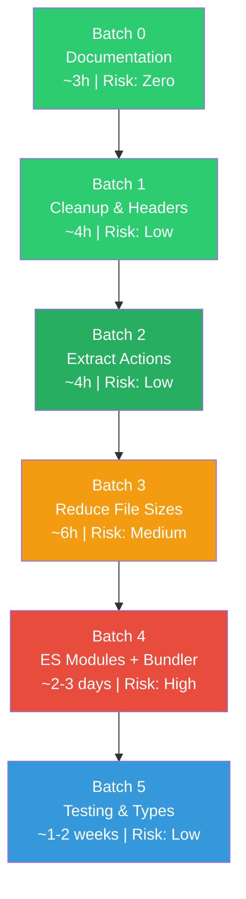

# 📐 MASTER PLAN: Architecture-Driven Refactoring

> **Replaces:** `refactoring_analysis.md` + `agent_friendly_architecture.md`  
> **Approach:** Architecture Contract → Codebase Mapping → Gap Analysis → Refactoring Actions  
> **Rule:** Mọi hành động refactor phải truy ngược về 1 gap cụ thể, mỗi gap phải truy ngược về 1 rule bị vi phạm trong Architecture Contract.

---

## PHẦN A — ARCHITECTURE CONTRACT (Bất biến)

> Đây là "ground truth". Mọi đánh giá, mọi đề xuất refactor đều quy chiếu về đây.

### Rule 1: Explicit Dependencies

```
MỌI module phải khai báo rõ ràng những gì nó cần (dependencies) 
và những gì nó cung cấp (exports).

TIÊU CHÍ PASS:
- File có import/require tường minh HOẶC liệt kê DEPENDENCIES trong header
- File có export statement cuối file
- KHÔNG dùng `typeof X !== 'undefined'` để check dependency

TIÊU CHÍ FAIL:
- Dùng global `window.X` không khai báo
- Dùng `typeof X !== 'undefined'` để graceful degrade
- Dependency order chỉ đúng nếu script tag đúng thứ tự
```

### Rule 2: Single Responsibility File

```
MỖI file chỉ làm 1 việc. Đo bằng:
- ≤ 150 LOC (không tính comments và blank lines)
- ≤ 8 public functions/methods
- ≤ 3 params per function (dùng object param nếu > 3)
- ≤ 3 nesting levels

TIÊU CHÍ FAIL:
- File > 150 LOC
- File chứa logic thuộc > 1 layer (vd: UI + Domain)
- Function > 40 LOC
```

### Rule 3: Module Contract Header

```
MỖI file JS phải bắt đầu bằng header 6 dòng:

/**
 * MODULE: [Tên module]
 * LAYER: [Logic/Core | Logic/Domain | Logic/Pipeline | Logic/Strategy | 
 *         Logic/UX | Component | Controller | Bridge | Entry]
 * PURPOSE: [1 câu mô tả]
 * DEPENDENCIES: [Liệt kê tên module] hoặc "None"
 * SIDE EFFECTS: [None (pure) | DOM | File I/O | CEP Bridge]
 * EXPORTS: [Tên.method1(), Tên.method2()]
 */

TIÊU CHÍ PASS: Header đầy đủ 6 trường, thông tin chính xác
TIÊU CHÍ FAIL: Thiếu header hoặc thông tin sai
```

### Rule 4: Consistent Export Pattern

```
TẤT CẢ modules dùng CÙNG MỘT pattern export:

// Pattern duy nhất (trước ES Modules):
if (typeof window !== 'undefined') window.ModuleName = ModuleName;

KHÔNG ĐƯỢC dùng:
- module.exports (vô dụng trong CEP browser context)
- Cả window + module.exports đồng thời
- Export khác tên với const/class declaration

TIÊU CHÍ PASS: Đúng 1 dòng export cuối file, đúng pattern
TIÊU CHÍ FAIL: Mixed patterns, tên export sai, thiếu export
```

### Rule 5: Layer Isolation (Hexagonal Compliance)

```
CẤM import ngược chiều giữa layers:

  Entry (main.js) 
    → Controller/Component 
      → Logic (Domain, Pipeline, Strategy, UX)
        → Core (Utilities)

CẤM: Logic gọi Component. Domain gọi Bridge. Core gọi Domain.

ExtendScript (.jsx): PHẢI dùng ES3. CẤM const/let/arrow/class.
CEP (.js): ES6+ tự do.
```

### Rule 6: Agent-Safe Zone Classification

```
MỖI file được phân loại:

🟢 SAFE: Agent tự chủ sửa/thêm. Pure logic, no side effects.
🟡 CAUTION: Agent sửa bug OK. Thêm feature/refactor cần human approval.
🔴 DANGER: Agent chỉ sửa khi được yêu cầu cụ thể + human review.

Phân loại dựa trên:
- Coupling degree (bao nhiêu module khác depend vào file này)
- Side effect type (None → Safe, DOM → Caution, Bridge/IO → Danger)
- Blast radius (sửa file này hỏng bao nhiêu chỗ khác)
```

---

## PHẦN B — CODEBASE MAPPING (Hiện trạng vs. Contract)

### B.1 Bảng đánh giá theo file

> ✅ = Pass, ❌ = Fail, ⚠️ = Partial

| File | LOC | R1 Deps | R2 Size | R3 Header | R4 Export | R5 Layer | Zone | Gaps |
|:-----|:----|:--------|:--------|:----------|:----------|:---------|:-----|:-----|
| **Entry** |
| `main.js` | 419 | ❌ inline wiring | ❌ 419 LOC | ❌ | ⚠️ window only | ⚠️ mixed layers | 🔴 | G1,G2,G3,G4 |
| `bridge.js` | 138 | ✅ CSInterface only | ✅ | ❌ | ⚠️ window only | ✅ | 🔴 | G3,G4 |
| `schemaLoader.js` | ~40 | ✅ | ✅ | ❌ | ⚠️ | ✅ | 🟢 | G3,G4 |
| **Components** |
| `TabbedPanel.js` | ~90 | ❌ implicit | ✅ | ❌ | ⚠️ | ✅ | 🟡 | G1,G3,G4 |
| `CompactFormBuilder.js` | 236 | ❌ 8+ globals | ❌ 236 LOC | ❌ | ⚠️ | ⚠️ logic mixed | 🔴 | G1,G2,G3,G4,G5 |
| `DateGridWidget.js` | 349 | ❌ 5+ globals | ❌ 349 LOC | ❌ | ⚠️ | ⚠️ mediator mixed | 🟡 | G1,G2,G3,G4 |
| `DomFactory.js` | 271 | ✅ none | ❌ 271 LOC | ❌ | ⚠️ | ✅ pure | 🟢 | G2,G3,G4 |
| `FormComponents.js` | 193 | ❌ builder refs | ❌ 193 LOC | ❌ | ⚠️ | ✅ | 🟡 | G1,G2,G3,G4 |
| `FormLogic.js` | 159 | ❌ 3+ globals | ❌ 159 LOC | ❌ | ⚠️ | ⚠️ | 🟡 | G1,G2,G3,G4 |
| `DateGridRenderer.js` | ~120 | ⚠️ | ✅ | ❌ | ⚠️ | ✅ | 🟡 | G3,G4 |
| **Controllers** |
| `ConfigController.js` | 139 | ⚠️ | ✅ | ❌ | ⚠️ | ✅ | 🟡 | G3,G4 |
| `WeddingProActionHandler.js` | 338 | ❌ controller ref | ❌ 338 LOC | ⚠️ has header | ⚠️ module.exports | ⚠️ | 🟡 | G1,G2,G4 |
| **Logic/Core** |
| `string.js` | ~50 | ✅ none | ✅ | ❌ | ⚠️ | ✅ | 🟢 | G3,G4 |
| `date.js` | ~60 | ✅ none | ✅ | ❌ | ⚠️ | ✅ | 🟢 | G3,G4 |
| **Logic/Domain** |
| `calendar.js` | 172 | ❌ fs.readFileSync | ❌ 172 LOC | ❌ | ⚠️ both | ⚠️ I/O in domain | 🟡 | G1,G2,G3,G4,G6 |
| `name.js` | ~80 | ✅ | ✅ | ❌ | ⚠️ | ✅ | 🟢 | G3,G4 |
| `rules.js` | 100 | ✅ | ✅ | ✅ has header | ⚠️ module.exports | ✅ | 🟢 | G4 |
| `time.js` | ~60 | ✅ | ✅ | ❌ | ⚠️ | ✅ | 🟢 | G3,G4 |
| `venue.js` | ~70 | ⚠️ | ✅ | ❌ | ⚠️ | ✅ | 🟢 | G3,G4 |
| **Logic/Pipeline** |
| `assembler.js` | 152 | ❌ setDependencies | ❌ 152 LOC | ❌ | ⚠️ | ⚠️ DI thủ công | 🟡 | G1,G2,G3,G4,G7 |
| `normalizer.js` | 65 | ✅ | ✅ | ❌ | ⚠️ | ✅ | 🟢 | G3,G4 |
| `validator.js` | 60 | ✅ | ✅ | ❌ | ⚠️ | ✅ | 🟢 | G3,G4 |
| `DataValidator.js` | 112 | ✅ | ✅ | ⚠️ partial | ⚠️ both | ✅ | 🟢 | G3,G4 |
| **Logic/Strategies** |
| `StrategyOrchestrator.js` | 139 | ❌ strategies implicit | ✅ | ❌ | ⚠️ | ✅ | 🟡 | G1,G3,G4 |
| `FreshStrategy.js` | 98 | ✅ | ✅ | ⚠️ partial | ❌ both | ✅ | 🟢 | G3,G4 |
| `SmartComplexStrategy.js` | ~130 | ✅ | ✅ | ❌ | ⚠️ | ✅ | 🟢 | G3,G4 |
| **Logic/UX** |
| `InputEngine.js` | 100 | ❌ 6+ typeof checks | ✅ | ❌ | ⚠️ | ✅ | 🟡 | G1,G3,G4 |
| `NameNormalizer.js` | ~60 | ✅ | ✅ | ❌ | ⚠️ | ✅ | 🟢 | G3,G4 |
| `AddressNormalizer.js` | ~50 | ✅ | ✅ | ❌ | ⚠️ | ✅ | 🟢 | G3,G4 |
| `DateNormalizer.js` | ~50 | ✅ | ✅ | ❌ | ⚠️ | ✅ | 🟢 | G3,G4 |
| `NameValidator.js` | ~40 | ✅ | ✅ | ❌ | ⚠️ | ✅ | 🟢 | G3,G4 |
| **ExtendScript** |
| `illustrator.jsx` | 324 | N/A (ES3) | ❌ 324 LOC | N/A | N/A | ✅ | 🔴 | G2 |
| `utils.jsx` | ~80 | N/A | ✅ | N/A | N/A | ✅ | 🔴 | — |
| **Other** |
| `index.html` | 295 | N/A | N/A | N/A | N/A | N/A | 🔴 | G8 |
| `DateGridWidget.legacy.js` | ~500 | — | — | — | — | — | — | G9 |

### B.2 Thống kê tổng hợp

| Rule | PASS | PARTIAL | FAIL | Compliance |
|:-----|:-----|:--------|:-----|:-----------|
| R1: Explicit Dependencies | 14 | 3 | 13 | **47%** |
| R2: Single Responsibility | 20 | 0 | 10 | **67%** |
| R3: Module Contract Header | 1 | 3 | 26 | **3%** |
| R4: Consistent Export | 0 | 28 | 2 | **0%** |
| R5: Layer Isolation | 24 | 4 | 2 | **80%** |
| R6: Zone Classification | (defined above) | | | N/A |

---

## PHẦN C — GAP ANALYSIS (Khoảng cách cụ thể)

> Mỗi gap truy ngược về Rule bị vi phạm. Mỗi gap sẽ sinh ra 1+ hành động refactor.

### G1: Implicit Global Dependencies

- **Rule vi phạm:** R1
- **Files affected:** `main.js`, `CompactFormBuilder.js`, `DateGridWidget.js`, `FormLogic.js`, `FormComponents.js`, `InputEngine.js`, `StrategyOrchestrator.js`, `assembler.js`, `calendar.js`, `WeddingProActionHandler.js`, `TabbedPanel.js`
- **Biểu hiện:**
  - 13 files dùng `typeof X !== 'undefined'` để check dependency
  - `main.js` wiring 10+ globals thủ công trong `init()`
  - `InputEngine.js` check 6 normalizer/validator globals
  - `assembler.js` dùng `setDependencies()` pattern
- **Hậu quả cho Agent:** Không biết chính xác API nào available. Phải đoán → hallucination risk.

### G2: Oversized Files

- **Rule vi phạm:** R2
- **Files vượt ngưỡng 150 LOC:**

| File | LOC | Vượt | Lý do |
|:-----|:----|:-----|:------|
| `main.js` | 419 | +269 | God Function init() chứa UI + wiring + actions |
| `DateGridWidget.js` | 349 | +199 | Mediator + event handlers + data sync all-in-one |
| `WeddingProActionHandler.js` | 338 | +188 | 8 action handlers + 2 utility + 1 toast |
| `DomFactory.js` | 271 | +121 | 15+ factory methods |
| `CompactFormBuilder.js` | 236 | +86 | Schema parsing + rendering + state management |
| `FormComponents.js` | 193 | +43 | 4 group builders |
| `calendar.js` | 172 | +22 | Data loading + computation |
| `FormLogic.js` | 159 | +9 | Event logic + venue automation |
| `assembler.js` | 152 | +2 | Pipeline 7 steps |
| `illustrator.jsx` | 324 | +174 | Adapters inlined (acceptable for ES3) |

- **Hậu quả cho Agent:** Agent phải đọc toàn bộ file để hiểu context → tốn tokens, giảm chính xác.

### G3: Missing Module Contract Headers

- **Rule vi phạm:** R3
- **Files thiếu:** 26/30 files JS (87%)
- **Files đã có (mẫu tốt):** `rules.js` — có header MODULE, Owner, Version
- **Hậu quả cho Agent:** Phải đọc toàn bộ file để hiểu purpose, dependencies, exports → chi phí x5.

### G4: Inconsistent Export Pattern

- **Rule vi phạm:** R4
- **3 pattern tồn tại đồng thời:**
  - `window.*` only (một số file)
  - `module.exports` only: `rules.js`, `WeddingProActionHandler.js`
  - Cả hai: `FreshStrategy.js`, `DataValidator.js`, `calendar.js`
- **Hậu quả cho Agent:** Không biết dùng pattern nào khi tạo file mới → convention drift.

### G5: Mixed Responsibilities trong Components

- **Rule vi phạm:** R2 + R5
- **File:** `CompactFormBuilder.js`
  - Schema parsing (Core concern)
  - DOM rendering (Component concern)
  - State management (`this.data`)
  - Event handling (Controller concern)
  - Auto-fill logic (Domain concern)
- **Hậu quả cho Agent:** Sửa 1 behavior → phải hiểu 5 concerns → scope creep risk.

### G6: I/O trong Domain Layer

- **Rule vi phạm:** R5
- **File:** `calendar.js` dùng `fs.readFileSync()` trực tiếp
- **Hậu quả cho Agent:** Không thể unit test. Nếu agent cần sửa calendar logic → phải mock fs → phức tạp.

### G7: Manual DI Wiring

- **Rule vi phạm:** R1
- **File:** `assembler.js` dùng `setDependencies()` — dependencies là optional, check bằng `if (this._deps.X)`
- **Hậu quả cho Agent:** Agent có thể quên gọi `setDependencies()` → assembler chạy nhưng skip logic.

### G8: 35 Script Tags với Load Order Thủ Công

- **Rule vi phạm:** R1
- **File:** `index.html` — 35 `<script>` tags, thứ tự là single point of failure
- **Hậu quả cho Agent:** Thêm module mới → phải thêm script tag đúng vị trí → dễ sai.

### G9: Dead Code

- **Rule vi phạm:** R2 (unnecessary code)
- **File:** `DateGridWidget.legacy.js` (~500 LOC) — đã được thay thế bởi refactored version
- **Hậu quả cho Agent:** Agent có thể đọc nhầm file legacy → sinh code theo pattern cũ.

---

## PHẦN D — REFACTORING ACTIONS (Dẫn xuất từ Gaps)

> **Nguyên tắc:** Mỗi action phải truy ngược về ≥1 gap. Không có action nào "vì best practice".

### Batch 0: Baseline Documentation (0 code changes)

> **Prerequisite cho mọi batch khác. Agent cần những artifact này để làm việc chính xác.**

| # | Action | Gap | Deliverable | Agent Benefit |
|:--|:-------|:----|:------------|:--------------|
| A0.1 | Tạo `API_SURFACE.md` | G1, G3 | File liệt kê tất cả public API + file location | Agent đọc 1 file → biết tên hàm chính xác, giảm hallucination 90% |
| A0.2 | Tạo `DEPENDENCY_MAP.md` | G1, G7 | File ánh xạ ai depend ai | Agent biết blast radius trước khi sửa |
| A0.3 | Tạo pre-flight checklist | G1-G8 | `.agent/workflows/pre-flight.md` | Agent tự verify trước khi code |
| A0.4 | Tạo module templates | G3, G4 | `.agent/templates/normalizer.js`, `action.js`, `validator.js` | Agent copy template thay vì viết từ đầu |

**Chi phí:** ~3 giờ. **Risk:** Zero (chỉ thêm docs).  
**Verification:** Đọc lại docs, xác nhận thông tin khớp với codebase.

---

### Batch 1: Cleanup & Headers (Minimal code changes)

> **Dependency:** Batch 0 hoàn thành (cần templates + API list).

| # | Action | Gap | File(s) | Change |
|:--|:-------|:----|:--------|:-------|
| A1.1 | Xóa legacy file | G9 | `DateGridWidget.legacy.js` | Delete file |
| A1.2 | Sửa duplicate call | G2 | `main.js:306,309` | Xóa 1 dòng `setupDebugButtons()` |
| A1.3 | Thêm header contract | G3 | 26 files JS | Thêm 6-dòng comment header vào đầu mỗi file |
| A1.4 | Thống nhất export | G4 | 30 files JS | Standardize: chỉ `window.*` export, xóa `module.exports` |

**Chi phí:** ~4 giờ. **Risk:** Rất thấp.  
**Verification:**
- `grep -r "module.exports" cep/js/` → 0 kết quả
- Mỗi file bắt đầu bằng `/** MODULE:` header
- `DateGridWidget.legacy.js` không tồn tại
- App vẫn chạy bình thường (manual test: mở panel, scan, update)

---

### Batch 2: Extract Actions from main.js

> **Dependency:** Batch 1 hoàn thành (headers chuẩn).

| # | Action | Gap | Change |
|:--|:-------|:----|:-------|
| A2.1 | Extract `ScanAction.js` | G1, G2 | Tách scan logic (~30 LOC) từ `main.js init()` |
| A2.2 | Extract `UpdateAction.js` | G1, G2 | Tách update logic (~35 LOC) |
| A2.3 | Extract `SwapAction.js` | G1, G2 | Tách swap logic (~23 LOC) |
| A2.4 | Slim down `main.js` | G2 | `main.js` giảm từ 419 → <120 LOC (chỉ bootstrap + wiring) |
| A2.5 | Thêm script tags cho actions | G8 | 3 `<script>` tags mới trong `index.html` |

**Cấu trúc file mới:**
```
js/actions/
├── ScanAction.js      (🟢 Safe zone, ~50 LOC)
├── UpdateAction.js    (🟡 Caution, ~60 LOC)
└── SwapAction.js      (🟢 Safe zone, ~40 LOC)
```

**Chi phí:** ~4 giờ. **Risk:** Thấp (move code, không thay đổi logic).  
**Verification:**
- `main.js` < 120 LOC
- Mỗi action file < 80 LOC
- Mỗi action file có header contract
- Manual test: Scan → Update → Swap → all work

---

### Batch 3: Reduce Oversized Files

> **Dependency:** Batch 2 hoàn thành.

| # | Action | Gap | File | Strategy |
|:--|:-------|:----|:-----|:---------|
| A3.1 | Split `DomFactory.js` | G2 | 271 → 2 files | `DomFactory.core.js` (inputs/rows) + `DomFactory.widgets.js` (checkboxes/buttons/panels) |
| A3.2 | Split `DateGridWidget.js` | G2 | 349 → extract event handlers | Tách event binding vào `DateGridEventHandlers.js` |
| A3.3 | Reduce `CompactFormBuilder.js` | G2, G5 | 236 → extract state | Tách `FormState.js` (data management ~60 LOC) |
| A3.4 | Reduce `WeddingProActionHandler.js` | G2 | 338 → extract UI helpers | Tách `showLoading`, `showError`, `showToast` vào `UIHelpers.js` |
| A3.5 | Abstract File I/O từ `calendar.js` | G6 | Tách `fs.readFileSync` → `FileReader` utility | `calendar.js` nhận data qua parameter thay vì đọc file trực tiếp |

**Chi phí:** ~6 giờ. **Risk:** Trung bình (cần test kỹ mỗi split).  
**Verification:**
- Mọi file ≤ 150 LOC
- Manual test: DateGrid compute đúng, form render đúng, scan/update work
- `calendar.js` không chứa `require('fs')` hoặc `readFileSync`

---

### Batch 4: ES Modules + Bundler

> **Dependency:** Batch 3 hoàn thành (tất cả files ≤150 LOC, headers chuẩn).  
> **Đây là batch lớn nhất. Transform toàn bộ module system.**

| # | Action | Gap | Change |
|:--|:-------|:----|:-------|
| A4.1 | Setup esbuild | G8 | Tạo `build.js`, `package.json` |
| A4.2 | Convert exports → ES Modules | G1, G4 | `window.X = X` → `export const X = ...` (tất cả files) |
| A4.3 | Convert imports → ES Modules | G1 | Thêm `import` statements thay cho globals |
| A4.4 | Tạo `composition-root.js` | G7 | Centralize DI wiring (thay `setDependencies`) |
| A4.5 | Replace 35 script tags | G8 | `index.html` chỉ còn `<script src="js/bundle.js">` |
| A4.6 | Xóa tất cả `typeof X !== 'undefined'` | G1, G7 | 0 implicit checks |

**Chi phí:** ~2-3 ngày. **Risk:** Cao (cần config cho CSInterface, window.require).  
**Verification:**
- `grep -r "typeof.*undefined" cep/js/` → 0 kết quả (trừ polyfills)
- `grep -r "window\." cep/js/` → chỉ CSInterface và DOM APIs
- `index.html` chỉ có 1-2 script tags
- esbuild build thành công < 500ms
- Manual test: Toàn bộ app hoạt động bình thường trong CEP

---

### Batch 5: Testing & Type Safety (Post-Module)

> **Dependency:** Batch 4 hoàn thành (ES Modules hoạt động).

| # | Action | Gap | Change |
|:--|:-------|:----|:-------|
| A5.1 | Setup Vitest | G1 | `vitest.config.js`, test scripts |
| A5.2 | Unit tests Logic/Domain | G1, G6 | Tests cho `DateLogic`, `CalendarEngine`, `name.js`, `rules.js` |
| A5.3 | Unit tests Logic/UX | G1 | Tests cho `NameNormalizer`, `DateNormalizer`, `AddressNormalizer` |
| A5.4 | Unit tests Pipeline | G7 | Tests cho `assembler.js` với injected dependencies |
| A5.5 | JSDoc `@ts-check` | G3 | Thêm type annotations + `// @ts-check` cho 🟢 Safe Zone files |
| A5.6 | ESLint setup | G4, G2 | `.eslintrc.js` với agent guardrail rules |

**Chi phí:** ~1-2 tuần. **Risk:** Thấp (thêm tooling, không sửa production code).  
**Verification:**
- `npm test` → all green
- Coverage > 70% cho logic layer
- `npx eslint cep/js/` → 0 errors

---

## PHẦN E — EXECUTION ORDER & DEPENDENCIES



### Checkpoint gates

| Gate | Điều kiện tiến sang batch tiếp | Kiểm tra bằng |
|:-----|:-------------------------------|:---------------|
| B0→B1 | `API_SURFACE.md` và `DEPENDENCY_MAP.md` tồn tại | File exists check |
| B1→B2 | 0 `module.exports`, 100% files có header | `grep` commands |
| B2→B3 | `main.js` < 120 LOC, 3 action files tồn tại | LOC count + test |
| B3→B4 | Mọi file ≤ 150 LOC | LOC count |
| B4→B5 | 0 `typeof X !== 'undefined'`, build OK | `grep` + build test |

---

## PHẦN F — SUCCESS METRICS

### Agent Cost Metrics (đo lường trực tiếp)

| Metric | Hiện tại (ước tính) | Sau Batch 0-1 | Sau Batch 4 |
|:-------|:--------------------|:--------------|:------------|
| Files agent phải đọc để hiểu 1 module | 3-5 files | 1 file (header) | 1 file (import) |
| Tokens cần để understand codebase | ~15,000 | ~8,000 | ~3,000 |
| Risk hallucinate tên hàm | ~20% | ~5% | ~1% |
| Risk scope creep | ~30% | ~15% | ~5% |
| Risk break load order | ~15% | ~10% | 0% |

### Architecture Compliance

| Metric | Hiện tại | Sau Batch 1 | Sau Batch 4 |
|:-------|:---------|:------------|:------------|
| R1 Compliance | 47% | 47% | **100%** |
| R2 Compliance | 67% | 67% | **100%** |
| R3 Compliance | 3% | **100%** | 100% |
| R4 Compliance | 0% | **100%** | 100% |
| R5 Compliance | 80% | 80% | **100%** |

### Developer Experience

| Metric | Hiện tại | Mục tiêu |
|:-------|:---------|:---------|
| Thêm 1 normalizer mới | Viết từ đầu, 3+ files | Copy template, 1 file |
| Agent sửa bug trong domain | Đọc 5 files context | Đọc 1 file + header |
| Agent thêm action mới | Sửa main.js God Function | Tạo 1 file action mới |
| Onboard developer/agent mới | Đọc 43 files | Đọc `API_SURFACE.md` |

---

## Traceability Matrix (Tổng hợp)

| Gap | Rule | Batch | Actions | Verification |
|:----|:-----|:------|:--------|:-------------|
| G1: Implicit deps | R1 | B0,B4 | A0.1, A0.2, A4.2, A4.3, A4.6 | 0 `typeof` checks |
| G2: Oversized files | R2 | B1,B2,B3 | A1.2, A2.1-A2.4, A3.1-A3.5 | All files ≤150 LOC |
| G3: Missing headers | R3 | B1 | A1.3 | 100% files have header |
| G4: Mixed exports | R4 | B1,B4 | A1.4, A4.2 | 1 export pattern only |
| G5: Mixed responsibilities | R2+R5 | B3 | A3.3 | Components ≤1 concern |
| G6: I/O in domain | R5 | B3 | A3.5 | `calendar.js` pure |
| G7: Manual DI | R1 | B4 | A4.4 | Constructor injection |
| G8: 35 script tags | R1 | B2,B4 | A2.5, A4.5 | ≤2 script tags |
| G9: Dead code | R2 | B1 | A1.1 | File deleted |
