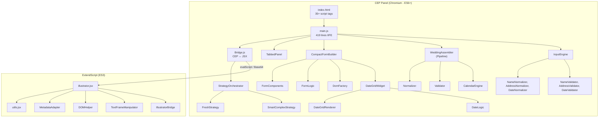
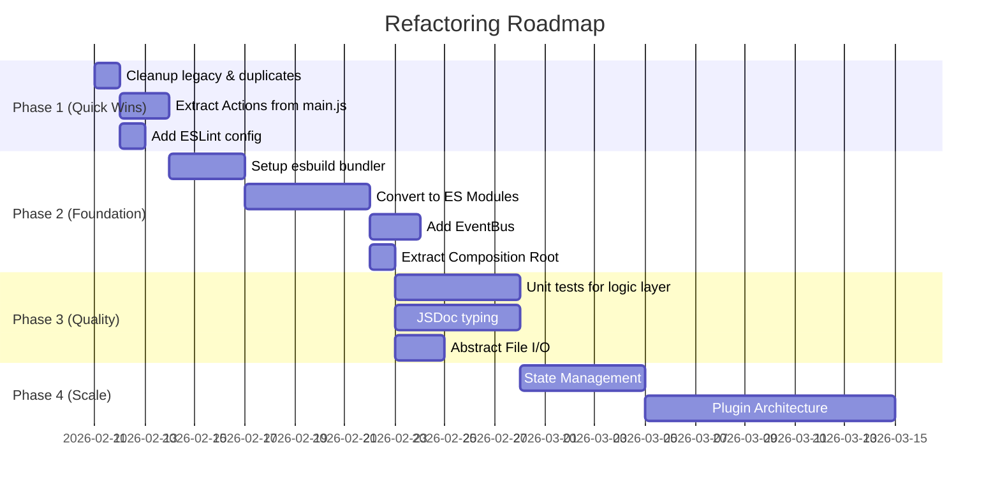

# 🔬 BẢN PHÂN TÍCH & KẾ HOẠCH TÁI CẤU TRÚC WEDDING SCRIPTER

> **Author:** Technical Lead / Software Architect Review  
> **Date:** 2026-02-10  
> **Scope:** CEP Extension for Adobe Illustrator — Full Codebase  
> **Methodology:** So sánh codebase hiện tại vs. community best practices

---

## Mục lục

1. [Tổng quan kiến trúc hiện tại](#1-tổng-quan-kiến-trúc-hiện-tại)
2. [Kiến thức từ cộng đồng (Community Benchmarks)](#2-kiến-thức-từ-cộng-đồng)
3. [Đối chiếu chi tiết: Chúng ta vs. Cộng đồng](#3-đối-chiếu-chi-tiết)
4. [Kế hoạch tái cấu trúc theo giai đoạn](#4-kế-hoạch-tái-cấu-trúc)
5. [Tiêu chí thành công (Success Metrics)](#5-tiêu-chí-thành-công)

---

## 1. Tổng quan kiến trúc hiện tại

### 1.1 Kiến trúc tổng thể



### 1.2 Thống kê mã nguồn

| Metric | Giá trị |
|:-------|:--------|
| **Tổng file JS (CEP)** | 43+ files |
| **Script tags trong index.html** | 35 tags (thứ tự load thủ công) |
| **Tổng dòng code ước tính** | ~4,500-5,000 LOC (JS+JSX) |
| **Module system** | ❌ Không có (global `window.*` exports) |
| **Build system / Bundler** | ❌ Không có |
| **Test framework** | ❌ Không có |
| **Linting / Formatting** | ❌ Không tự động (chỉ có ES3 guard hook thủ công) |
| **Type system** | ❌ Không có (JSDoc thưa thớt) |

### 1.3 Điểm mạnh hiện tại

1. **Layered Architecture rõ ràng**: Đã chia thành components → controllers → logic (core/domain/pipeline/strategies/ux). Đây là nỗ lực có ý thức và tốt hơn phần lớn CEP extensions.
2. **Pipeline Pattern hoạt động tốt**: `WeddingAssembler` có pipeline 7 bước rõ ràng (normalize → name split → parent prefixes → date expansion → time → venue → mapping).
3. **Strategy Pattern cho TextFrame**: `StrategyOrchestrator` điều phối `FreshStrategy` và `SmartComplexStrategy` — thiết kế mở rộng tốt.
4. **UX Automation Layer**: `InputEngine` routing theo field type đến các normalizer/validator riêng biệt — tách biệt concerns tốt.
5. **Mediator Pattern cho DateGridWidget**: Tách View (`DateGridRenderer`), Logic (`DateLogic`), và Mediator — refactor gần đây, chất lượng tốt.
6. **DomFactory thuần DOM**: Không có business logic, chỉ tạo elements — đúng Single Responsibility.
7. **Agent Knowledge Base (.agent/)**: Hệ thống skills, workflows, decision logs mạnh mẽ cho quản lý kiến thức.
8. **ES3/ES6 Boundary được enforce**: Hook system chặn ES6 trong `.jsx` files.

### 1.4 Vấn đề cốt lõi (Critical Issues)

#### 🔴 P0: Dependency Management bằng `window.*` globals

**Hiện trạng:** 43+ modules đều export ra `window.*`. Dependencies giữa modules là implicit (dùng `typeof X !== 'undefined'` để kiểm tra).

```javascript
// Ví dụ từ InputEngine.js
if (typeof DateNormalizer !== 'undefined') {
    return DateNormalizer.normalize(value, { ...options, type });
}
// Nếu DateNormalizer load fail hoặc load sau InputEngine → silent failure
```

**Hậu quả:**
- Load order trong `index.html` là **single point of failure** — sai thứ tự = silent bugs
- Không thể tree-shake, mỗi page load tất cả 35 scripts
- Không thể unit test module độc lập (cần mock toàn bộ `window.*`)
- Refactor rename 1 global → phải tìm thủ công khắp codebase

#### 🔴 P0: `main.js` là God Function (419 dòng)

**Hiện trạng:** `main.js` chứa toàn bộ app logic trong function `init()`:
- Khai báo tab controllers inline (200+ dòng event handlers cho scan/update/swap)
- Wiring dependencies thủ công (`WeddingAssembler.setDependencies({...})`)
- DI Container tạm bợ bằng `typeof X !== 'undefined' ? X : null`
- UI feedback logic (toast, loading overlay)
- JSX loader

**Hậu quả:**
- Thêm 1 button mới → sửa main.js → risk breaking scan/update flow
- Business logic (swap POS logic, venue auto-update) nằm trong event handler → untestable
- Duplicate code: `setupDebugButtons()` được gọi 2 lần (line 306, 309)

#### 🟡 P1: Object Literal Singletons thay vì Classes

**Hiện trạng:** Phần lớn modules dùng `const X = { ... }` (object literal singleton) thay vì classes.

```javascript
// Normalizer, Validator, CalendarEngine, ConfigController, DateGridWidget...
const Normalizer = {
    normalize(packet, schema) { ... }
};
```

**Tradeoff thực tế:**
- ✅ Đơn giản, không cần `new`
- ❌ Không thể tạo multiple instances (ví dụ: test 2 calendar engine configs khác nhau)
- ❌ Không có encapsulation (mọi `_private` method đều accessible)
- ❌ Khó mock trong test

#### 🟡 P1: Mixed Export Strategy

**Hiện trạng:** Có 3 kiểu export khác nhau:
```javascript
// Kiểu 1: window only
if (typeof window !== 'undefined') window.X = X;

// Kiểu 2: module.exports only  
if (typeof module !== 'undefined') module.exports = X;

// Kiểu 3: Cả hai
if (typeof module !== 'undefined' && module.exports) module.exports = X;
if (typeof window !== 'undefined') window.X = X;
```

**Hậu quả:** Không nhất quán, gây nhầm lẫn khi debug. Một số module export qua `module.exports` nhưng không bao giờ được `require()`.

#### 🟡 P1: CalendarEngine dùng Node.js `fs` trực tiếp

```javascript
// calendar.js line 37-41
let fs;
if (typeof window.require === 'function') {
    fs = window.require('fs');
}
const content = fs.readFileSync(csvPath, 'utf8');
```

**Vấn đề:** Đây là CEP-specific API (`window.require`). Nếu migrate sang UXP, Web worker, hoặc test environment → broken ngay lập tức. Cần abstract qua FileAdapter.

#### 🟢 P2: CSS không có methodology

3 file CSS (`main.css`, `compact.css`, `date-grid.css`) không có naming convention thống nhất:
- `main.css` dùng prefix `--ds-*` (design system tokens) — tốt
- `compact.css` dùng BEM-like (`compact-panel__body`) — tốt
- `date-grid.css` mix class names — chưa thống nhất

#### 🟢 P2: Tồn tại legacy file

`DateGridWidget.legacy.js` (19KB) vẫn còn trong codebase dù refactor xong.

---

## 2. Kiến thức từ cộng đồng

### 2.1 CEP/UXP Extension Patterns (Adobe Community)

| Pattern | Mô tả | Nguồn tham khảo |
|:--------|:-------|:-----------------|
| **ES Modules + Bundler** | Dùng Vite/Webpack bundle thành 1 file, giữ source dùng `import/export` | [bolt-cep](https://github.com/nicholascarr/bolt-cep), [cep-bundler-core](https://github.com/nicholascarr/cep-bundler-core) |
| **Event Bus / EventEmitter** | Components giao tiếp qua events, không gọi trực tiếp | Figma Plugin API, VS Code Extension API |
| **Dependency Injection Container** | Centralized DI thay vì wiring thủ công | Angular, InversifyJS, tsyringe |
| **Port/Adapter (Hexagonal)** | Abstract I/O (file system, CEP bridge) qua interfaces | Clean Architecture (Robert C. Martin) |
| **Schema-Driven UI** | Define form structure in JSON, render dynamically | [React JSON Schema Form](https://github.com/rjsf-team/react-json-schema-form), Formik |
| **Command Pattern** | Centralize user actions thành discrete commands | VS Code Command Palette, Redux actions |

### 2.2 Best Practices cho Plugin/Extension Architecture

#### a) Module System — Community Consensus

Theo survey của State of JS 2024 và patterns từ bolt-cep, cep-bundler-core:

```
Community Standard:
├── src/           (ES Modules - import/export)
├── build/         (Bundled output cho CEP)
└── vite.config.js (hoặc webpack.config.js)
```

**Rationale:** Source code dùng ES Modules, bundler compile thành 1-2 files tương thích CEP. Kết quả:
- Tree-shaking loại bỏ dead code
- Explicit dependencies (import statements)
- IDE autocomplete + type checking
- Unit testable (jest/vitest import trực tiếp)

#### b) State Management — Redux/Zustand Pattern

Thay vì state nằm rải rác trong DOM refs (`DateGridWidget._refs`), form data (`CompactFormBuilder.data`), và globals (`window.compactBuilder`):

```javascript
// Community Pattern: Centralized State
const store = createStore({
    formData: {},
    uiState: { activeTab: 'compact', loading: false },
    computedData: {} // Kết quả từ pipeline
});

// Components subscribe to state changes
store.subscribe('formData', (newData) => renderer.update(newData));
```

#### c) Event-Driven Architecture — Pub/Sub

Thay vì:
```javascript
// Hiện tại: Direct coupling trong main.js
scanBtn.addEventListener('click', async () => {
    const result = await bridge.scanDocument();
    // ... 30 dòng inline logic
    window.compactBuilder.setData(normalized);
    DateGridWidget.triggerCompute();
});
```

Community pattern:
```javascript
// Event Bus
EventBus.on('scan:complete', (data) => formBuilder.setData(data));
EventBus.on('scan:complete', (data) => dateGrid.recompute(data));
EventBus.emit('scan:request');
```

#### d) Testing Strategy — Testing Trophy

```
Community Testing Trophy:
          /\
         /  \  E2E (Playwright/Puppeteer)
        /----\
       /      \ Integration (components + logic)
      /--------\
     /          \ Unit (pure functions, domain logic)
    /____________\
      Static Analysis (ESLint, TypeScript)
```

Với codebase này, ROI cao nhất:
1. **Static Analysis** (ESLint) — cheap, catches 80% bugs
2. **Unit Tests** cho logic layer (pure functions: DateLogic, CalendarEngine, Normalizers)
3. **Integration Tests** cho pipeline (Assembler + dependencies)

---

## 3. Đối chiếu chi tiết

### 3.1 Module System

| Tiêu chí | Chúng ta | Cộng đồng | Gap Analysis |
|:---------|:---------|:-----------|:-------------|
| **Import/Export** | `window.*` globals | ES Modules (`import/export`) | 🔴 **Critical** — Nguồn gốc phần lớn vấn đề |
| **Dependency Declaration** | Implicit (`typeof X !== 'undefined'`) | Explicit (`import X from './X'`) | 🔴 Load order bugs, silent failures |
| **Bundling** | 35 script tags, thứ tự thủ công | 1-2 bundled files (Vite/esbuild) | 🟡 Performance, maintainability |
| **Tree-shaking** | Không thể | Tự động bởi bundler | 🟢 Ít quan trọng với ~5K LOC |

**Tại sao cách cộng đồng tốt hơn:**
- Mỗi `import` statement là 1 explicit contract → IDE báo lỗi ngay khi dependency bị xóa/rename
- Bundler đảm bảo load order tự động → không bao giờ gặp "undefined is not a function"
- Unit test chỉ cần import module cần test, không cần setup toàn bộ window globals

**Trade-off khi áp dụng:**
- Cần thêm build step (Vite/esbuild) → complexity tăng
- CEP environment có quirks với bundler (cần config đặc biệt cho `CSInterface`, Node.js `require`)
- Thời gian migration: ~2-3 ngày cho experienced developer

### 3.2 Application Architecture

| Tiêu chí | Chúng ta | Cộng đồng | Gap |
|:---------|:---------|:-----------|:----|
| **Entry Point** | God Function `init()` 240+ dòng | Composition Root + DI Container | 🔴 |
| **Action Handling** | Inline event handlers trong `init()` | Command Pattern / Action Creators | 🟡 |
| **State Management** | Spread across DOM refs, `this.data`, globals | Centralized store (Redux-like) | 🟡 |
| **DI Wiring** | `typeof X !== 'undefined' ? X : null` | DI Container hoặc Factory | 🟡 |
| **Error Boundaries** | `try-catch` per handler, toast | Global error handler + per-action feedback | 🟢 |

**Tại sao cách cộng đồng tốt hơn (Action Handling):**

Hiện tại, swap logic (23 dòng) nằm inline trong `main.js init()`. Nếu cần thêm "Undo swap" → phải sửa cùng function init(). Community pattern:

```javascript
// Command/Action Pattern
const SwapPosAction = {
    execute(formData) {
        const swapped = {};
        // ... logic (TESTABLE!)
        return swapped;
    },
    undo(originalData) { /* reverse */ }
};

// Controller chỉ gọi:
swapBtn.onclick = () => {
    const result = SwapPosAction.execute(builder.getData());
    builder.setData(result);
};
```

### 3.3 Domain Logic Layer

| Tiêu chí | Chúng ta | Cộng đồng | Gap |
|:---------|:---------|:-----------|:----|
| **Separation of Concerns** | ✅ Tốt (domain/pipeline/strategies) | N/A | ✅ On par |
| **Pipeline Pattern** | ✅ WeddingAssembler 7-phase | Middleware pattern (Express/Koa) | ✅ On par |
| **Strategy Pattern** | ✅ StrategyOrchestrator | N/A | ✅ On par |
| **Pure Functions** | ⚠️ Phần lớn pure nhưng CalendarEngine có side effects (fs.readFile) | Pure + Adapter | 🟡 |
| **Error Handling trong Pipeline** | ⚠️ `if (this._deps.X)` skip silently | Result/Either monad hoặc explicit errors | 🟡 |

**Nhận xét:** Logic layer *đã tốt*. Đây là khu vực ít cần refactor nhất. Cần tập trung vào cách nó được wired và consumed.

### 3.4 Component Architecture

| Tiêu chí | Chúng ta | Cộng đồng | Gap |
|:---------|:---------|:-----------|:----|
| **Form Builder** | Schema-driven ✅ | Schema-driven ✅ | ✅ On par |
| **Component Reusability** | DomFactory thuần DOM ✅ | Web Components / Framework | ✅ Phù hợp (CEP constraint) |
| **State ↔ View Sync** | Manual DOM manipulation | Reactive binding (Lit, Preact signals) | 🟡 |
| **Accessibility** | Partial (role, aria-selected) | Full ARIA compliance | 🟢 Low priority cho internal tool |

### 3.5 ExtendScript Layer

| Tiêu chí | Chúng ta | Cộng đồng |
|:---------|:---------|:-----------|
| **Organization** | 1 file monolithic (324 dòng), adapters inlined | Tách adapters ra files riêng |
| **Communication** | Base64 encode → JSON | Base64 encode → JSON (standard pattern) ✅ |
| **Error Handling** | try-catch + sendResult | try-catch + sendResult ✅ |

**Nhận xét:** ExtendScript side đơn giản và hợp lý cho quy mô hiện tại. Inlining adapters là acceptable vì ES3 không có module system.

---

## 4. Kế hoạch tái cấu trúc

### Phase 1: Quick Wins — Ngắn hạn (1-2 ngày)

> **Mục tiêu:** Giảm risk, cải thiện developer experience, zero breaking changes.

#### 1.1 Dọn dẹp legacy và duplicate code

- [ ] Xóa `DateGridWidget.legacy.js` (đã backup trong git history)
- [ ] Sửa duplicate call `setupDebugButtons()` trong main.js (line 306, 309)
- [ ] Thống nhất export style: tất cả dùng `window.*` (bỏ `module.exports` vô dụng)

**Chi phí:** ~1 giờ  
**Risk:** Rất thấp

#### 1.2 Extract Actions từ main.js

Tách inline event handlers thành module riêng:

```
js/actions/
├── ScanAction.js      ← Scan logic (30 dòng từ main.js)
├── UpdateAction.js    ← Update logic (35 dòng từ main.js)  
└── SwapAction.js      ← Swap POS logic (23 dòng từ main.js)
```

**Kết quả:** `main.js init()` giảm từ 240 → ~80 dòng. Actions có thể test độc lập.

**Chi phí:** ~3-4 giờ  
**Risk:** Thấp (chỉ move code, không thay đổi logic)

#### 1.3 Thêm ESLint config cơ bản

```json
{
  "env": { "browser": true, "es2020": true },
  "rules": {
    "no-unused-vars": "warn",
    "no-undef": "error",
    "no-duplicate-imports": "error"
  },
  "overrides": [{
    "files": ["*.jsx"],
    "rules": { "no-var": "off" }
  }]
}
```

**Chi phí:** ~1 giờ  
**Risk:** Zero (chỉ thêm tooling, không sửa code)

---

### Phase 2: Foundation — Trung hạn (1-2 tuần)

> **Mục tiêu:** Chuyển sang ES Modules + bundler. Đây là investment lớn nhất nhưng unlock mọi improvement tiếp theo.

#### 2.1 Setup Build System (Vite/esbuild)

> [!IMPORTANT]
> Đây là quyết định kiến trúc quan trọng nhất. Nếu không có module system, mọi refactor khác đều bị giới hạn.

**Proposed:** esbuild (đơn giản nhất, fastest build, zero config)

```
project/
├── src/                    ← Source code với ES Modules
│   ├── main.js             ← import { ScanAction } from './actions/scan'
│   ├── bridge.js           ← export class Bridge { ... }
│   ├── components/
│   ├── logic/
│   └── actions/
├── cep/                    ← Build output
│   ├── js/
│   │   └── bundle.js       ← 1 file, auto-generated
│   ├── jsx/                ← Không bundle (ES3)
│   └── index.html          ← 1 script tag
└── build.js                ← esbuild script
```

**Trade-offs:**
- ✅ Explicit imports → IDE autocomplete, refactor safety
- ✅ 35 script tags → 1 file → faster load
- ✅ Unlock unit testing (jest/vitest có thể import modules)
- ⚠️ Dev workflow thay đổi (cần chạy build sau mỗi edit, hoặc dùng watch mode)
- ⚠️ CEP quirks: `CSInterface`, `window.require` cần config `external`
- ⚠️ Thời gian migration: ~2-3 ngày

#### 2.2 Introduce Simple Event Bus

```javascript
// src/core/EventBus.js
export const EventBus = {
    _handlers: {},
    on(event, fn) { /* ... */ },
    off(event, fn) { /* ... */ },
    emit(event, data) { /* ... */ }
};
```

Dùng cho:
- `scan:request` → `scan:complete` / `scan:error`
- `update:request` → `update:complete`
- `form:changed` → subscribers react
- `date:computed` → UI updates

**Trade-offs:**
- ✅ Loose coupling giữa components
- ✅ Dễ thêm side effects (logging, analytics) mà không sửa business logic
- ⚠️ Debug khó hơn (event flow implicit) → cần logging middleware

#### 2.3 Extract DI Composition Root

```javascript
// src/composition-root.js
import { Bridge } from './bridge';
import { CalendarEngine } from './logic/domain/calendar';
import { Normalizer } from './logic/pipeline/normalizer';
// ...

export function bootstrap() {
    const bridge = new Bridge();
    const calendar = new CalendarEngine();
    
    const assembler = new WeddingAssembler({
        normalizer: Normalizer,
        calendarEngine: calendar,
        // ... explicit, no typeof checks
    });

    return { bridge, assembler, calendar };
}
```

---

### Phase 3: Quality — Trung-dài hạn (2-4 tuần)

> **Mục tiêu:** Testing, type safety, performance monitoring.

#### 3.1 Unit Tests cho Logic Layer

**ROI Analysis:**

| Module | Testability | Priority | ROI |
|:-------|:-----------|:---------|:----|
| `DateLogic` | ✅ Pure function | P0 | 🟢 Rất cao |
| `CalendarEngine` | ⚠️ Cần mock fs | P0 | 🟢 Cao |
| `NameNormalizer` | ✅ Pure | P0 | 🟢 Cao |
| `AddressNormalizer` | ✅ Pure | P1 | 🟢 Cao |
| `WeddingAssembler` | ⚠️ Cần DI | P1 | 🟡 Trung bình |
| `StrategyOrchestrator` | ✅ Có interfaces | P1 | 🟡 Trung bình |
| `Bridge` | ❌ Cần CEP env | P2 | 🔴 Thấp |
| `CompactFormBuilder` | ❌ Cần DOM | P2 | 🔴 Thấp |

**Recommended:** Vitest + jsdom, bắt đầu từ logic layer (30+ test cases có thể viết trong 1 ngày).

#### 3.2 JSDoc Typing (Lightweight TypeScript alternative)

Thay vì migrate sang TypeScript full (cost quá cao):

```javascript
/**
 * @typedef {Object} LunarDate
 * @property {number} day
 * @property {number} month
 * @property {string} lunar_year_txt
 * @property {string} thu
 */

/**
 * @param {number} day
 * @param {number} month
 * @param {number} year
 * @returns {LunarDate|null}
 */
getLunarDate(day, month, year) { ... }
```

Kết hợp với `// @ts-check` ở đầu file → IDE sẽ type check mà không cần TypeScript compiler.

**Trade-offs:**
- ✅ Zero build cost — chỉ comments
- ✅ IDE autocomplete + error detection
- ⚠️ Không strict bằng TypeScript
- ⚠️ Verbose hơn (nhưng serve as documentation)

#### 3.3 Abstract File I/O

```javascript
// src/adapters/FileAdapter.js
export class CepFileAdapter {
    readSync(path) {
        const fs = window.require('fs');
        return fs.readFileSync(path, 'utf8');
    }
    exists(path) {
        const fs = window.require('fs');
        return fs.existsSync(path);
    }
}

// Test environment
export class MockFileAdapter {
    constructor(files = {}) { this._files = files; }
    readSync(path) { return this._files[path] || null; }
    exists(path) { return path in this._files; }
}
```

---

### Phase 4: Scale — Dài hạn (1-3 tháng)

> **Mục tiêu:** Chuẩn bị cho features lớn và team mở rộng.

#### 4.1 State Management Layer

Nếu form data trở nên phức tạp (nhiều tab, undo/redo, autosave):

```javascript
// Simple observable store (không cần Redux)
export function createStore(initialState) {
    let state = { ...initialState };
    const listeners = new Map();
    
    return {
        get(key) { return state[key]; },
        set(key, value) {
            state[key] = value;
            listeners.get(key)?.forEach(fn => fn(value));
        },
        subscribe(key, fn) {
            if (!listeners.has(key)) listeners.set(key, new Set());
            listeners.get(key).add(fn);
            return () => listeners.get(key).delete(fn);
        }
    };
}
```

> [!WARNING]
> Chỉ đầu tư khi có nhu cầu thực sự (thêm undo/redo, multi-tab state). Hiện tại DOM-based state đủ dùng.

#### 4.2 UXP Migration Path

Nếu quyết định migrate sang UXP trong tương lai:
- ES Modules + bundler (Phase 2) sẽ là prerequisite
- FileAdapter abstraction (Phase 3) cho phép swap CEP → UXP file API
- Bridge class cần UXP adapter (khác API hoàn toàn)

#### 4.3 Plugin Architecture cho Logic

Nếu cần hỗ trợ nhiều loại thiệp (wedding, birthday, corporate):

```javascript
// Plugin system
const plugins = {
    'wedding': { assembler: WeddingAssembler, schema: 'wedding.json' },
    'birthday': { assembler: BirthdayAssembler, schema: 'birthday.json' },
};
```

---

## 5. Tiêu chí thành công

### 5.1 Metrics sau Phase 1 (Quick Wins)

| Metric | Hiện tại | Mục tiêu |
|:-------|:---------|:---------|
| `main.js` LOC | 419 | < 150 |
| Dead code files | 1 (legacy) | 0 |
| Duplicate function calls | 1 | 0 |
| ESLint errors | N/A | 0 errors, < 10 warnings |

### 5.2 Metrics sau Phase 2 (Foundation)

| Metric | Hiện tại | Mục tiêu |
|:-------|:---------|:---------|
| Script tags | 35 | 1 (bundle.js) |
| Implicit dependencies | 43+ | 0 (all explicit imports) |
| `typeof X !== 'undefined'` checks | ~20 | 0 |
| Build time | N/A | < 500ms (esbuild) |

### 5.3 Metrics sau Phase 3 (Quality)

| Metric | Hiện tại | Mục tiêu |
|:-------|:---------|:---------|
| Test coverage (logic layer) | 0% | > 70% |
| Type-annotated functions | ~10% | > 60% |
| Documented public APIs | ~20% | > 80% |

### 5.4 Developer Experience Metrics

| Metric | Hiện tại | Mục tiêu |
|:-------|:---------|:---------|
| Thêm 1 field mới | Sửa 3+ files, biết load order | Sửa schema.json + 1 file |
| Thêm 1 action mới | Sửa main.js (risk) | Tạo 1 file action mới (isolated) |
| Debug một lỗi logic | Đọc 35 script tags, check globals | IDE "Go to Definition" |
| Onboard developer mới | Đọc .agent/ docs + hiểu globals | Import graph tự giải thích |

---

## Roadmap tổng hợp



---

## Rủi ro & Giảm thiểu

| Rủi ro | Xác suất | Tác động | Giảm thiểu |
|:-------|:---------|:---------|:-----------|
| **Bundler break CEP globals** (CSInterface, window.require) | Cao | Cao | Config `external` trong esbuild, test kỹ trên CEP trước khi commit |
| **Migration làm gián đoạn dev** | Trung bình | Cao | Phase 1 không đụng architecture → ship ngay. Phase 2 làm trên branch riêng |
| **Team không quen module system** | Thấp | Trung bình | Document workflow mới trong `.agent/workflows/` |
| **Performance regression từ bundling** | Rất thấp | Thấp | 1 bundle file load nhanh hơn 35 files HTTP requests |
| **Test maintenance cost** | Trung bình | Thấp | Chỉ test pure logic (ROI cao nhất), skip UI tests |

---

> [!TIP]
> **Khuyến nghị ưu tiên:** Phase 1 → Phase 2.1 (esbuild) → Phase 1.2 (Extract Actions). Ba bước này mang lại 80% giá trị với 20% effort. Phase 3-4 thực hiện dần theo nhu cầu thực tế, không nên làm trước khi foundation xong.
