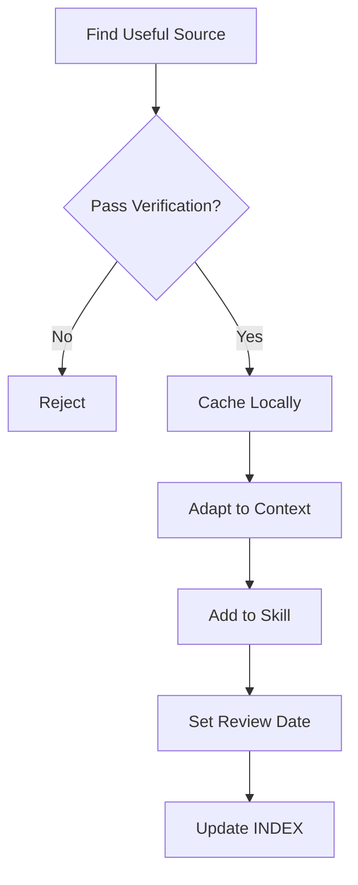

# .agent Governance & Modification Guide

> **MỤC ĐÍCH:** Framework để enhance .agent một cách kiểm soát, maintain quality khi scale

**Version:** 1.0  
**Last Updated:** 2026-01-19  
**Applies to:** .agent v2.0+

---

## 🎯 Philosophy: Quality > Quantity

### Core Principles:

1. **Evolution, Not Revolution** - Incremental improvements, không big bang
2. **Prove Before Scale** - Test thoroughly trước khi expand
3. **Delete > Add** - Remove outdated content aggressive hơn add new
4. **User Value First** - Mỗi addition phải answer: "Giúp gì cho agent làm việc tốt hơn?"

---

## 📏 Modification Standards

### Rule 1: Every Change Must Have Clear Owner

**Format:**
```yaml
---
name: Skill_Name
version: 1.2.0
owner: Your Name
last_updated: 2026-01-19
changelog: |
  - 1.2.0 (2026-01-19): Added 3 examples
  - 1.1.0 (2026-01-15): Fixed typos
  - 1.0.0 (2026-01-10): Initial version
---
```

**Why:** Accountability, track changes, know who to ask

---

### Rule 2: All Skills Must Pass Quality Gate

**Checklist Before Adding/Modifying Skill:**

```markdown
## Quality Gate Checklist

- [ ] **Purpose Clear:** Single responsibility, không overlap existing skills
- [ ] **Examples Concrete:** Có code examples, không chỉ theory
- [ ] **Length Reasonable:** < 300 lines (split nếu longer)
- [ ] **Links Valid:** Tất cả internal links work
- [ ] **Tested:** Verify agent can use it effectively
- [ ] **Documented:** YAML frontmatter complete
```

**Fail ANY item** → Reject hoặc revise

---

### Rule 3: Versioning Strategy

**Semantic Versioning:** MAJOR.MINOR.PATCH

- **MAJOR:** Breaking changes (cấu trúc thay đổi hoàn toàn)
- **MINOR:** New features (add skills, major sections)
- **PATCH:** Fixes, updates (typos, small improvements)

**Examples:**
- Add new skill → MINOR bump
- Restructure directory → MAJOR bump
- Fix typo → PATCH bump
- Update example code → PATCH bump

**Version File:** `.agent/VERSION`
```
2.0.1
```

---

## 🆕 Adding New Content

### How to Add New Skill

**Step-by-Step:**

1. **Justify Need**
   ```markdown
   ## New Skill Proposal
   
   **Name:** Authentication_Patterns
   **Purpose:** Guide đối authentication trong CEP panels
   **Gap Filled:** Current không có security guidance
   **Estimated Size:** 200 lines
   **Time to Create:** 2 hours
   **Maintenance:** Low (stable patterns)
   ```

2. **Check for Overlap**
   - Search existing skills
   - Nếu overlap >30% → Enhance existing instead of new

3. **Create Structure**
   ```
   .agent/skills/New_Skill/
   ├── SKILL.md
   ├── examples/ (optional)
   └── resources/ (optional)
   ```

4. **Use Template**
   ```markdown
   ---
   name: New_Skill
   description: One-line description
   version: 1.0.0
   owner: Your Name
   tools: [relevant, tools]
   ---
   
   # Skill: New_Skill
   
   ## Purpose
   [Why this exists]
   
   ## When to Use
   [Situations]
   
   ## Content
   [Main content]
   
   ## Examples
   [Code examples]
   
   ## Related Skills
   [Cross-references]
   ```

5. **Quality Gate**
   - Run checklist
   - Test với real task
   - Get feedback (from yourself after 1 day break)

6. **Integrate**
   - Update `Skills_Index/SKILL.md`
   - Update `README.md` if needed
   - Update `VERSION` file
   - Document in changelog

---

### How to Add Code Examples

**Standards:**

```markdown
## Code Example Standards

**Location:** `.agent/skills/Code_Examples/examples/{category}/`

**Categories:**
- domain/ (Business logic)
- adapters/ (External APIs)
- ui/ (User interface)
- utilities/ (Helpers)

**File Format:**
- Name: `{purpose}_example.jsx`
- Size: < 200 lines
- Must have: JSDoc header, usage examples, comments
- Must test: Run in Illustrator, verify works

**Header Template:**
/**
 * Example: [Name]
 * 
 * PURPOSE: [What it does]
 * WHEN TO USE: [Situations]
 * HEXAGONAL LAYER: [Domain/Application/Infrastructure]
 * DEPENDENCIES: [List or None]
 * 
 * @example
 * [Usage code]
 */
```

**Quality Bar:**
- ✅ Working code (tested)
- ✅ ES3 compliant (for JSX)
- ✅ Self-contained (minimal dependencies)
- ✅ Realistic (real use case)
- ✅ Documented (WHY not WHAT)

---

## 🌐 Internet Source Integration

### When to Use External Sources

**✅ Good Candidates:**
- Stable, well-maintained libraries
- Official documentation (Adobe, Mozilla)
- Proven patterns (GitHub Awesome lists)
- Stack Overflow answers (score >100, multiple confirmations)

**❌ Avoid:**
- Random blogs
- Outdated tutorials (>2 years)
- Unverified snippets
- Paywalled content

---

### Verification Protocol

**File:** `.agent/external/verification/CHECKLIST.md`

```markdown
# External Source Verification Checklist

## Source Quality
- [ ] Author credentials verified (GitHub profile, company, portfolio)
- [ ] Publication date < 12 months (or evergreen content)
- [ ] Multiple corroborating sources (min 2)
- [ ] No ads/spam/clickbait
- [ ] License allows usage

## Content Quality
- [ ] Code tested in your environment
- [ ] No security vulnerabilities
- [ ] Relevant to project context (ExtendScript/CEP/Wedding domain)
- [ ] Scalable to codebase size
- [ ] Maintainable (understandable, not 10x complex)

## Integration
- [ ] Adapted to project style (not copy-paste)
- [ ] Attribution clear (source link, author, date)
- [ ] Local copy cached (not just link)
- [ ] Review date set (when to re-verify)

## PASS = ALL checkboxes ✅
## FAIL = ANY checkbox ❌ → Reject
```

---

### Integration Workflow



**Directory Structure:**
```
.agent/external/
├── sources/
│   └── INDEX.md (catalog)
├── cache/
│   └── 2026-01-19_github_extendscript_patterns.md
└── verification/
    └── CHECKLIST.md
```

---

### Review Cycle

**Quarterly Review (Every 3 Months):**

```markdown
## External Sources Review (YYYY-MM-DD)

| Source | Status | Action |
|:-------|:-------|:-------|
| GitHub ES3 Polyfills | ✅ Current | Keep |
| Adobe CEP Samples | ⚠️ Outdated | Update cache |
| Hexagonal Examples | ❌ Broken link | Remove |

**Actions Taken:**
- Updated 2 sources
- Removed 1 obsolete
- Added 0 new

**Next Review:** YYYY-MM-DD
```

---

## 📊 Quality Metrics

### Track These Metrics

```markdown
## .agent Health Report (Monthly)

**Date:** 2026-01-19

### Size Metrics
- Total Skills: 10
- Total Lines: ~5,000
- Total Examples: 3
- Total Lessons: 5

### Quality Metrics
- Skills with YAML frontmatter: 10/10 (100%)
- Skills with examples: 8/10 (80%)
- Broken links: 0
- Outdated content (>6 months): 1 item

### Usage Metrics
- Most used skill: ES3_ES6_Boundary
- Least used skill: Deployment_Architecture
- Average session reads: 6 skills

### Actions Required
- [ ] Update 1 outdated content item
- [ ] Add example to 2 skills without examples
```

**Decision Rules:**
- If skill NOT used in 6 months → Consider deprecate
- If >5 broken links → Quality issue, fix immediately
- If size >10,000 lines → Too large, split

---

## 🚨 Warning Signs (When to Stop Adding)

### Red Flags:

1. **Complexity Creep** 🔴
   - Agent takes >10 min to load context
   - You can't remember what's in all skills
   - New developers confused by structure

   **Action:** STOP adding, start refactoring/removing

2. **Maintenance Burden** 🔴
   - Spending >2h/week on .agent updates
   - External sources require weekly reviews
   - Breaking changes frequent

   **Action:** Simplify, reduce external dependencies

3. **Diminishing Returns** 🟡
   - New additions don't improve agent performance
   - Score plateaus despite additions
   - More docs ≠ better results

   **Action:** Focus on quality of existing, not quantity

4. **Version Conflicts** 🟡
   - Multiple versions of truth
   - Contradicting guidance
   - Duplicated content

   **Action:** Consolidate, delete, merge

---

## ✂️ Deprecation Policy

### When to Remove Content

**Criteria for Deprecation:**
- Not used in 6 months
- Replaced by better content
- No longer relevant
- Maintenance burden too high

**Process:**

1. **Mark Deprecated**
   ```markdown
   > **⚠️ DEPRECATED:** This skill is deprecated as of 2026-01-19.  
   > **Reason:** Replaced by New_Skill  
   > **Migration:** See [New_Skill](../New_Skill/SKILL.md)
   ```

2. **Grace Period:** 1 month (give time to migrate)

3. **Archive**
   - Move to `.agent/docs/archive/deprecated/`
   - Remove from Skills_Index
   - Update README

4. **Delete** (after 6 months in archive)

---

## 🔄 Modification Workflow

### Standard Process for Any Change

```markdown
## Modification Checklist

### Before
- [ ] Read this governance guide
- [ ] Check if change overlaps existing content
- [ ] Justify need (write proposal if major)
- [ ] Estimate effort

### During
- [ ] Follow templates
- [ ] Write clear, concise content
- [ ] Add examples
- [ ] Test with real task

### After
- [ ] Run quality gate checklist
- [ ] Update VERSION file
- [ ] Update Skills_Index
- [ ] Document in changelog
- [ ] Review sau 1 day (fresh eyes)

### Review Cycle
- Minor changes: Self-review OK
- Major changes: Wait 1 day, re-read
- Breaking changes: Create backup first
```

---

## 📈 Scaling Strategy

### Growth Phases

**Phase 1: Foundation (Current - v2.0)**
- 10 skills
- 3 examples
- 5 lessons
- **Strategy:** Quality over quantity

**Phase 2: Expansion (v2.x)**
- 12-15 skills (add carefully)
- 10 examples (category coverage)
- 10 lessons (common errors)
- External sources: 5 verified
- **Strategy:** Fill gaps selectively

**Phase 3: Maturity (v3.x)**
- 15-20 skills (soft cap)
- 20 examples (comprehensive)
- 20 lessons (systematic)
- External sources: 10-15 verified
- **Strategy:** Consolidate, refine, optimize

**Phase 4: Maintenance (v4.x+)**
- Stable skill count (remove = add)
- Update existing (don't just add)
- Deep not wide
- **Strategy:** Quality maintenance, selective growth

**Hard Cap:** 25 skills, 10,000 total lines  
**Reason:** Beyond this = too complex to maintain

---

## 🎓 Best Practices

### Do's ✅

1. **Start Small** - Prototype in personal notes first
2. **Use Templates** - Don't reinvent format
3. **Link Generously** - Connect related skills
4. **Version Everything** - Track all changes
5. **Test Immediately** - Verify agent can use it
6. **Review Quarterly** - Keep content fresh
7. **Delete Fearlessly** - Archive, don't hoard

### Don'ts ❌

1. **Don't Duplicate** - One truth per concept
2. **Don't Copy-Paste** - Adapt, don't clone
3. **Don't Skip Verification** - For external sources
4. **Don't Over-Engineer** - Simple > complex
5. **Don't Ignore Metrics** - Track size, usage
6. **Don't Fear Breaking** - Backup, then refactor
7. **Don't Add Without Removing** - Balance growth

---

## 🛡️ Risk Mitigation

### Major Risks & Mitigations

**Risk 1: Content Bloat** 🔴
- **Mitigation:** Hard cap (25 skills), deprecation policy
- **Monitor:** Monthly size metrics
- **Action:** Delete if >cap

**Risk 2: Quality Decay** 🟡
- **Mitigation:** Quality gates, quarterly reviews
- **Monitor:** Broken links, outdated content
- **Action:** Fix immediately or deprecate

**Risk 3: Inconsistency** 🟡
- **Mitigation:** Templates, version control
- **Monitor:** Contradicting guidance
- **Action:** Consolidate, merge

**Risk 4: External Source Drift** 🟡
- **Mitigation:** Verification protocol, review cycle
- **Monitor:** Dead links, outdated info
- **Action:** Update cache or remove

---

## 📝 Templates

### Skill Proposal Template

```markdown
# New Skill Proposal

**Name:** [Skill_Name]  
**Proposed by:** [Your Name]  
**Date:** [YYYY-MM-DD]

## Problem Statement
[What gap exists in current .agent?]

## Proposed Solution
[How will this skill address it?]

## Scope
- Estimated size: [X lines]
- Time to create: [Y hours]
- Maintenance: [Low/Medium/High]

## Overlap Check
- Similar existing skills: [List or None]
- Overlap %: [X%]
- Justification if >30%: [Reason]

## Success Criteria
- [ ] Agent can [specific action]
- [ ] Reduces [specific problem]
- [ ] Improves [specific metric]

## Decision
- [ ] Approved → Proceed
- [ ] Rejected → Document why
- [ ] Deferred → Revisit [date]
```

---

### External Source Template

```markdown
# External Source Entry

**Source:** [URL]  
**Title:** [Title]  
**Author:** [Name/Org]  
**Date:** [Publication date]  
**Cached:** [Local file path]  
**Added:** [YYYY-MM-DD]  
**Next Review:** [YYYY-MM-DD + 3 months]

## Verification
- [x] Author credentials verified
- [x] Content tested
- [x] Relevant to project
- [x] No security issues
- [x] License OK

## Usage
**Integrated in:**
- [Skill 1](link)
- [Skill 2](link)

## Notes
[Any special considerations]
```

---

## 🚀 Quick Start: Making Your First Change

### Scenario: Add New Code Example

```bash
# 1. Read this guide (you're doing it!)

# 2. Create example file
code .agent/skills/Code_Examples/examples/utilities/my_example.jsx

# 3. Follow template, write code, test

# 4. Run quality gate
✓ Purpose clear?
✓ < 200 lines?
✓ Working code?
✓ Documented?

# 5. Update catalog
code .agent/skills/Code_Examples/SKILL.md
# Add entry to table

# 6. Bump version
echo "2.0.2" > .agent/VERSION

# 7. Done! ✅
```

---

## 📊 Governance Metrics

**Track in:** `.agent/docs/governance_metrics.md`

```markdown
## Governance Health (Monthly)

**Month:** 2026-01

### Compliance
- Quality gates passed: 100%
- Deprecated items cleaned: 100%
- External sources reviewed: 100%

### Performance
- Average PR review time: 1 day
- Broken link incidents: 0
- Version conflicts: 0

### Growth
- Skills added: 1
- Skills removed: 0
- Net growth: +1 (within limits)
```

---

## 🎯 Success Criteria

**.agent Governance is WORKING if:**

1. ✅ Changes follow process 100%
2. ✅ No unreviewed external sources
3. ✅ Quality score stable/improving
4. ✅ Maintenance <2h/week
5. ✅ No major incidents (broken structure, lost content)
6. ✅ Size within limits (<10,000 lines)

**Review annually:** This guide itself!

---

**Last Updated:** 2026-01-19  
**Next Review:** 2027-01-19  
**Owner:** Your Name  
**Version:** 1.0.0
