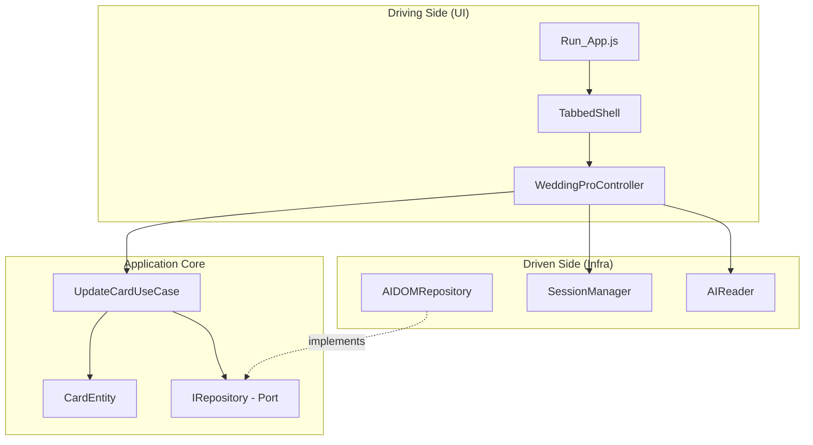

# Skill: Project Context (The Navigator)

> **MỤC ĐÍCH:** Đây là tài liệu "onboarding" cho Agent. Khi bắt đầu session mới hoặc cần nhớ lại context, Agent nên đọc file này ĐẦU TIÊN.

---

## 1. Thông tin Dự án

| Thuộc tính | Giá trị |
|------------|---------|
| **Tên dự án** | Wedding Scripter (Hỗ trợ thiệp cưới Adobe Illustrator) |
| **Ngôn ngữ** | ExtendScript ES3 (JavaScript cũ cho Adobe) |
| **Kiến trúc** | Hexagonal (Ports & Adapters) |
| **Entry Point** | [`Run_App.js`](file:///i:/My%20Drive/script%20ho%20tro%20adobe%20illustrator/Run_App.js) |
| **Config chính** | [`Config.js`](file:///i:/My%20Drive/script%20ho%20tro%20adobe%20illustrator/Config.js) |

---

## 2. Bản đồ Thư mục (Directory Map)

```
i:/My Drive/script ho tro adobe illustrator/
│
├── Run_App.js              ← Entry point, Bootstrapper, DI Container
├── Config.js               ← Cấu hình window title, modules
│
├── .agent/                 ← Agent Knowledge Base (Iceberg Structure)
│   ├── PROJECT_STATUS.md   ← Command Center (đọc ĐẦU TIÊN)
│   ├── AGENT_PREFERENCES.md
│   ├── memory/             ← 🧠 Active Knowledge
│   │   ├── skills/         ← Coding skills & standards
│   │   ├── workflows/      ← Step-by-step workflows
│   │   ├── templates/      ← Code templates
│   │   └── planning/       ← Planning documents
│   └── archive/            ← 📦 Legacy (read-only)
│       ├── docs/
│       └── legacy_tools/
│
├── cep/                    ← CEP Panel (HTML/JS/JSX)
│   ├── index.html
│   ├── js/                 ← ES6+ JavaScript controllers
│   └── jsx/                ← ES3 ExtendScript bridge
│
└── src/
    ├── Domain/             ← [CORE] Entities, Business Rules
    │   └── CardEntity.js
    │
    ├── Application/        ← [CORE] Use Cases, Ports
    │   ├── Ports/
    │   │   └── IRepository.js
    │   └── UseCases/
    │       └── UpdateCardUseCase.js
    │
    ├── Infrastructure/     ← [ADAPTERS] Kết nối thế giới thực
    │   ├── Illustrator/
    │   │   └── AIDOMRepository.js
    │   ├── System/
    │   │   └── SessionAdapter.js
    │   └── UI/
    │       ├── TabbedShell.js
    │       ├── LayoutBuilder.js
    │       ├── MainController.js
    │       └── WeddingProController.js
    │
    ├── Modules/            ← [FEATURE MODULES] Các module chức năng chính
    │   └── WeddingPro/     ← Module xử lý thiệp cưới
    │       ├── Config_Schema.jsx   ← QUAN TRỌNG: Định nghĩa cấu trúc dữ liệu
    │       ├── WeddingCore/
    │       │   ├── index.jsx
    │       │   ├── Adapters/       ← AIReader, MetadataAdapter, DOMHelper
    │       │   ├── Domain/         ← NameProcessor, DataFactory, Rules
    │       │   ├── Infrastructure/ ← SessionManager
    │       │   ├── UI/             ← LayoutBuilder, ComponentFactory, Widgets
    │       │   └── Utils/          ← DateConverter, StringSanitizer
    │       └── ngay.csv            ← Database Âm Dương Lịch
    │
    ├── Shared/             ← Thư viện dùng chung (Polyfills, Utils)
    │   └── index.jsx
    │
    └── Utils/              ← Utilities cấp project
```

---

## 3. Key Files - Khi nào cần mở?

| Tình huống | File cần mở |
|------------|-------------|
| Thêm trường dữ liệu mới | [`Config_Schema.jsx`](file:///i:/My%20Drive/script%20ho%20tro%20adobe%20illustrator/src/Modules/WeddingPro/Config_Schema.jsx) |
| Sửa giao diện nhập liệu | [`WeddingCore/UI/LayoutBuilder.jsx`](file:///i:/My%20Drive/script%20ho%20tro%20adobe%20illustrator/src/Modules/WeddingPro/WeddingCore/UI/LayoutBuilder.jsx) |
| Tạo component UI mới | [`WeddingCore/UI/ComponentFactory.jsx`](file:///i:/My%20Drive/script%20ho%20tro%20adobe%20illustrator/src/Modules/WeddingPro/WeddingCore/UI/ComponentFactory.jsx) |
| Xử lý logic tên người | [`WeddingCore/Domain/NameProcessor.jsx`](file:///i:/My%20Drive/script%20ho%20tro%20adobe%20illustrator/src/Modules/WeddingPro/WeddingCore/Domain/NameProcessor.jsx) |
| Đọc/ghi TextFrame từ AI | [`WeddingCore/Adapters/AIReader.jsx`](file:///i:/My%20Drive/script%20ho%20tro%20adobe%20illustrator/src/Modules/WeddingPro/WeddingCore/Adapters/AIReader.jsx) |
| Xử lý ngày Âm/Dương | [`WeddingCore/Utils/DateConverter.jsx`](file:///i:/My%20Drive/script%20ho%20tro%20adobe%20illustrator/src/Modules/WeddingPro/WeddingCore/Utils/DateConverter.jsx) |
| Debug khởi động app | [`Run_App.js`](file:///i:/My%20Drive/script%20ho%20tro%20adobe%20illustrator/Run_App.js) |

---

## 4. Luồng dữ liệu chính (Data Flow)

```
┌─────────────────────────────────────────────────────────────────┐
│                        USER INTERACTION                         │
└─────────────────────────────────────────────────────────────────┘
                              │
                              ▼
┌─────────────────────────────────────────────────────────────────┐
│  1. Run_App.js khởi động → Load modules → Gọi runUI()          │
└─────────────────────────────────────────────────────────────────┘
                              │
                              ▼
┌─────────────────────────────────────────────────────────────────┐
│  2. TabbedShell.build() tạo Window với các Tab                  │
│     → Gọi WeddingProController.render() cho tab Wedding Pro     │
└─────────────────────────────────────────────────────────────────┘
                              │
                              ▼
┌─────────────────────────────────────────────────────────────────┐
│  3. WeddingProController:                                       │
│     a. Load Schema (Config_Schema.jsx)                          │
│     b. AIReader.scan() đọc TextFrames từ file AI               │
│     c. WeddingPacketOrchestrator.process() xử lý dữ liệu       │
│     d. LayoutBuilder.buildInside() render UI                    │
└─────────────────────────────────────────────────────────────────┘
                              │
                              ▼
┌─────────────────────────────────────────────────────────────────┐
│  4. User nhập liệu → Click UPDATE                               │
│     → DataHarvester.collect() thu thập dữ liệu từ UI           │
│     → SessionManager.updateAndReload() gửi BridgeTalk          │
└─────────────────────────────────────────────────────────────────┘
                              │
                              ▼
┌─────────────────────────────────────────────────────────────────┐
│  5. BridgeTalk gọi HexCore.handleUpdate() trong engine mới     │
│     → UpdateCardUseCase.execute() xử lý nghiệp vụ              │
│     → AIDOMRepository.save() ghi vào TextFrames                │
└─────────────────────────────────────────────────────────────────┘
```

---

## 5. Module Dependencies (Quan hệ phụ thuộc)



---

## 6. Namespace chính (Global Objects)

| Namespace | Mô tả | Ví dụ truy cập |
|-----------|-------|----------------|
| `$.global.HexCore` | Core framework | `HexCore.runUI()`, `HexCore.handleUpdate()` |
| `$.global.WeddingCore` | Module Wedding | `WeddingCore.Domain.NameProcessor` |
| `$.global.Schema` | Cấu hình Schema | `Schema.STRUCTURE`, `Schema.TYPE` |
| `$.global.AppConfig` | Config app | `AppConfig.WINDOW_TITLE` |

---

## 7. Checklist Context Recovery

Khi bắt đầu task mới, Agent nên:

1. **[ ] Xác định Layer:** Task này thuộc Domain, Application, hay Infrastructure?
2. **[ ] Xác định Module:** Thuộc WeddingPro hay module khác?
3. **[ ] Xác định Key Files:** Cần sửa file nào? (Xem bảng ở Section 3)
4. **[ ] Check Dependencies:** File này phụ thuộc hoặc được phụ thuộc bởi file nào?
5. **[ ] Review Skills liên quan:**
   - Kiến trúc → Đọc `Hexagonal_Rules`
   - Viết code → Đọc `Code_Style_Standard`
   - Refactor → Đọc `Coding_Principles`

---

## 8. Trạng thái Dự án Hiện tại

> **Cập nhật lần cuối:** 2026-01-15

### Đã hoàn thành:
- [x] Kiến trúc Hexagonal cơ bản
- [x] Module WeddingPro với nhập liệu thiệp cưới
- [x] Hệ thống Agent Skills (3 skills + 1 context)
- [x] Chuyển đổi Âm/Dương lịch

### Đang phát triển:
- [ ] Cải thiện UX (Dynamic Labels, Validation)
- [ ] Workflows cho các tác vụ thường xuyên

### Backlog:
- [ ] Thêm module mới (Coming Soon tab)
- [ ] Export PDF/Print

---

## 9. Troubleshooting nhanh

| Vấn đề | Kiểm tra |
|--------|----------|
| Script không chạy | Kiểm tra `#target illustrator` ở đầu file |
| Module không load | Kiểm tra thứ tự `load()` trong `Run_App.js` |
| UI không hiện | Kiểm tra `app.documents.length > 0` |
| Lỗi "undefined is not a function" | Kiểm tra ES3 compatibility (không dùng arrow, const, let) |
| BridgeTalk timeout | Kiểm tra `#targetengine` match giữa 2 phía |

---

## Tài liệu Liên quan

- [Hexagonal_Rules](file:///i:/My%20Drive/script%20ho%20tro%20adobe%20illustrator/.agent/skills/Hexagonal_Rules/SKILL.md) - Quy tắc kiến trúc
- [Coding_Principles](file:///i:/My%20Drive/script%20ho%20tro%20adobe%20illustrator/.agent/skills/Coding_Principles/SKILL.md) - Nguyên lý lập trình
- [Code_Style_Standard](file:///i:/My%20Drive/script%20ho%20tro%20adobe%20illustrator/.agent/skills/Code_Style_Standard/SKILL.md) - Quy chuẩn code
- [kiến trúc và tư duy.md](file:///i:/My%20Drive/script%20ho%20tro%20adobe%20illustrator/kiến%20trúc%20và%20tư%20duy.md) - Tài liệu gốc kiến trúc
