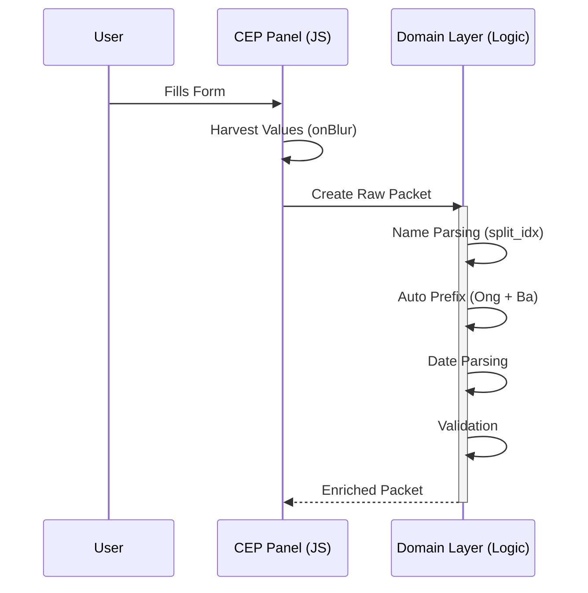
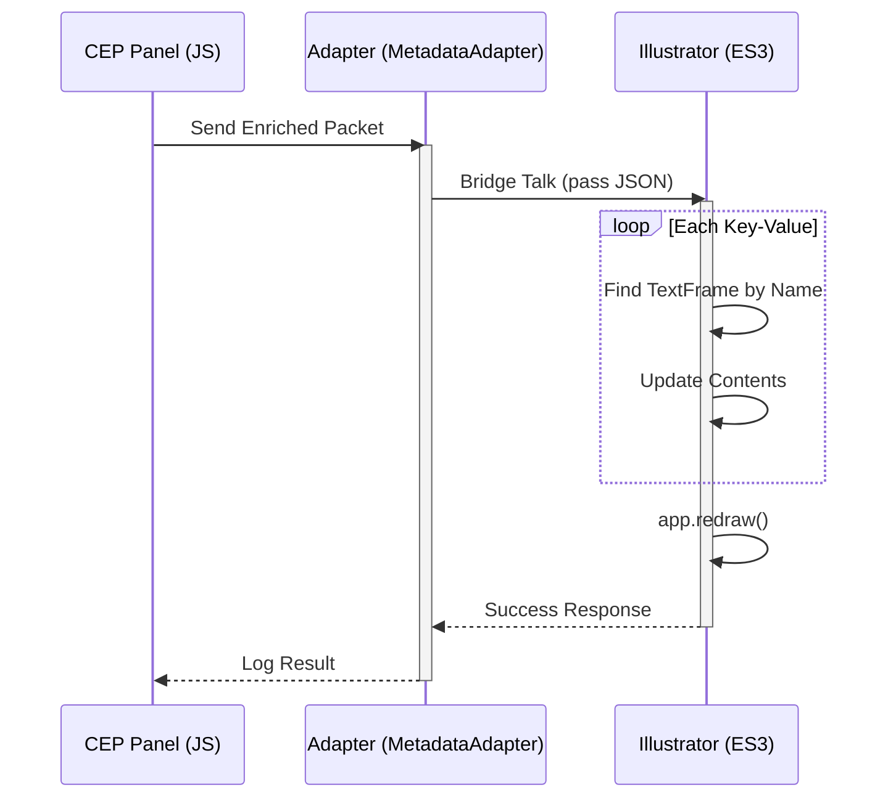
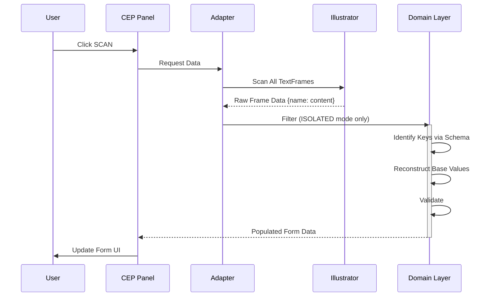
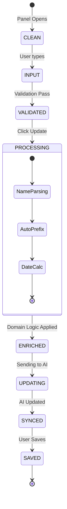

# Skill: Wedding Domain Knowledge

> **MỤC ĐÍCH:** Giúp agent hiểu rõ domain nghiệp vụ Wedding Card - Concepts, Rules, Flows

---

## 🚀 TL;DR
1.  **Object:** Thiệp Cưới (Wedding Card) với 2 bên (Nam/Nữ) + Lễ + Tiệc.
2.  **Logic:** Tự động tách tên (Họ/Đệm/Tên), tự sinh Prefix (Ông/Bà), tự tính ngày (Lễ/Tiệc/Nháp).
3.  **Flow:** UI (JS) → Packet → Adapter → Illustrator (ES3) update TextFrame.
4.  **Key Rule:** Font Unicode dựng sẵn. TextFrame name match key schema.
5.  **Files:** Schema (`Config_Schema.js`), Logic (`NameProcessor.js`), Adapter (`MetadataAdapter.jsx`).

---

## 📖 Domain Glossary

### Core Entities

| Term (Vietnamese) | English | Description |
|:------------------|:--------|:------------|
| **Vị trí 1 / Pos 1** | Position 1 | Thông tin bên NAM (chú rể và gia đình) |
| **Vị trí 2 / Pos 2** | Position 2 | Thông tin bên NỮ (cô dâu và gia đình) |
| **Ông** | Grandfather (paternal) | Ông nội/ngoại |
| **Bà** | Grandmother (paternal) | Bà nội/ngoại |
| **Bố** | Father | Not used in current schema |
| **Mẹ** | Mother | Not used in current schema |
| **Con** | Child (bride/groom) | Tên cô dâu/chú rể |

### Event Types

| Term | Description | Usage |
|:-----|:------------|:------|
| **Tiệc Cưới** | Wedding Party | Default event type |
| **Tân Gia** | Housewarming | Alternative event |
| **Sinh Nhật** | Birthday | Alternative event |

### Ceremony Types (Loại Lễ)

| Term | Meaning | Trigger Behavior |
|:-----|:--------|:-----------------|
| **Tân Hôn** | New Marriage | Default (trigger = 0) |
| **Thành Hôn** | Established Marriage | Default (trigger = 0) |
| **Vu Quy** | Bride's Return | Special (trigger = 1) |
| **Báo Hỷ** | Announcement | Default (trigger = 0) |

**RULE:** `trigger` field determines which "Vị trí" is primary in layout

### Participant Order Index (Vị thứ)

**Male (Nam):**
- Trưởng Nam (First son)
- Thứ Nam (Second son)
- Út Nam (Youngest son)
- Quý Nam (Special son)
- ... Nam (Other)

**Female (Nữ):**
- Trưởng Nữ (First daughter)
- Thứ Nữ (Second daughter)
- Út Nữ (Youngest daughter)
- Quý Nữ (Special daughter)
- ... Nữ (Other)

### Location Types

| Key | Type | Description |
|:----|:-----|:------------|
| **ceremony.*** | Ceremony Location | Nơi làm lễ (thường tại tư gia) |
| **venue.*** | Party Venue | Địa điểm tiệc (có thể tại tư gia hoặc nhà hàng) |
| **pos1.diachi** | Address 1 | Địa chỉ bên nam |
| **pos2.diachi** | Address 2 | Địa chỉ bên nữ |

**RULE:** `is_tugia` checkbox determines if location is "Tại tư gia" (at home)

### Date Types

| Key | Meaning | Auto-fill Rule |
|:----|:--------|:---------------|
| **date.tiec** | Party Date | BASE date (user input) |
| **date.le** | Ceremony Date | AUTO: Same day as tiec (offset = 0) |
| **date.nhap** | Practice/Rehearsal | AUTO: One day before tiec (offset = -1) |

**STANDARD TIMES:**
- Lễ: 09:00
- Tiệc: 11:00
- Nháp: 17:00

---

## ⚙️ Data Model

### Field Structure Pattern

**Format:** `{prefix}.{key}`

Example: `pos1.ong` = Tên ông bên vị trí 1

**Prefixes:**
- `pos1` - Position 1 (Nam)
- `pos2` - Position 2 (Nữ)
- `ceremony` - Ceremony location
- `venue` - Party venue
- `date` - Date/time info
- `info` - General info
- `ui` - UI-specific settings

### Field Types

| Type | Description | Example | Validation |
|:-----|:------------|:--------|:-----------|
| `TEXT` | Plain text | `pos1.diachi` | Any string |
| `NAME` | Person name | `pos1.ong` | Requires split_idx for parsing |
| `SELECT` | Dropdown | `info.ten_le` | Must match options list |
| `DATE` | Date picker | `date.tiec` | yyyy-MM-dd format |
| `CHECKBOX` | Boolean | `venue.is_tugia` | true/false |

### Derived Fields

**NAME type** auto-generates:
- `.ten` - Tên chính (given name)
- `.lot` - Họ đệm (middle name)
- `.ho_dau` - Họ (surname - first word)
- `.dau` - Chữ cái đầu (initial)

**DATE type** auto-generates:
- `.gio`, `.phut` - Hour, minute
- `.thu` - Day of week
- `.ngay`, `.thang`, `.nam` - Day, month, year (solar)
- `.namyy` - Year 2 digits
- `.ngay_al`, `.thang_al`, `.nam_al` - Lunar calendar

---

## 🔄 Business Rules

### Rule 1: Name Parsing

**When:** Field type = NAME  
**Requires:** Corresponding `{key}_split_idx` field  
**Process:**
1. User inputs full name: "Nguyễn Văn An"
2. User selects index: 0 = last word, 1-5 = specific position
3. System splits vào `.ten`, `.lot`, `.ho_dau`, `.dau`

**Example:**
```
Input: pos1.ong = "Nguyễn Văn An", pos1.ong_split_idx = "0"
Output:
  pos1.ong.ten = "An"
  pos1.ong.lot = "Văn"
  pos1.ong.ho_dau = "Nguyễn"
  pos1.ong.dau = "A"
```

### Rule 2: Auto Prefix Generation

**When:** Both `pos*.ong` AND `pos*.ba` have values  
**Output:** `pos*.ongba` prefix

**Logic:**
```
if (có ông && có bà) → "Ông Bà:"
if (có ông only)     → "Ông:"
if (có bà only)      → "Bà:"
if (không có cả 2)   → ""
```

### Rule 3: Date Auto-fill

**BASE:** `date.tiec` (user input)  
**AUTO:**
- `date.le` = tiec + 0 days (same day, 09:00)
- `date.nhap` = tiec - 1 day (previous day, 17:00)

**User can override** auto values if needed

### Rule 4: Sync Mode

**Purpose:** Control reverse sync từ AI file → Form

| Sync Mode | Behavior | When to Use |
|:----------|:---------|:------------|
| `ISOLATED` | Can read FROM file | Simple text fields |
| `NONE` | Cannot read FROM file | Template fields, complex formats |

**Example:**
- `pos1.ong` = ISOLATED → Có thể scan từ file
- `date.tiec` = NONE → Không scan (vì có format template "Ngày...")

### Rule 5: Trigger Field

**Field:** `info.ten_le` (loại lễ)  
**Purpose:** Determines which position is primary

**Logic:**
```javascript
if (ten_le === "Vu Quy") {
    primary = pos2 (bên nữ)
} else {
    primary = pos1 (bên nam)
}
```

**Affects:** UI ordering, template selection

---

## 📊 Data Flow

### 1. User Input → Form → Packet

### 1. User Input → Form → Packet (Update Flow)



### 2. Illustrator Update (Adapter Flow)



### 3. Illustrator Scan → Packet (Reverse Sync)



---

## 🎯 State Lifecycle



---

## 🏗️ Architecture Code Mapping

Mapping logic nghiệp vụ vào file cụ thể:

| Domain Entity | Logic Location | Function/Key |
|:--------------|:---------------|:-------------|
| **Schema/Fields** | `cep/js/config/Config_Schema.js` | `CONFIG_SCHEMA` object |
| **Name Split** | `cep/js/logic/NameProcessor.js` | `splitName()` |
| **Auto Prefix** | `cep/js/logic/PrefixLogic.js` | `generatePrefix()` |
| **Date Logic** | `cep/js/logic/DateLogic.js` | `calculateRelatedDates()` |
| **Scan/Read** | `cep/jsx/adapters/MetadataAdapter.jsx` | `getAllFrames()` |
| **Write/Update** | `cep/jsx/illustrator.jsx` | `updateTextFrames()` |

---

## 🧠 Deep Rules (Implicit Knowledge)

Các luật ngầm quan trọng (Tribal Knowledge):

### 1. Font Handling (Tiếng Việt)
- **VNI Fonts:** Cần mapping bảng mã riêng. Hiện tại hệ thống **chưa support** auto-convert VNI. Input phải là Unicode ( dựng sẵn).
- **Fallback:** Nếu user dùng font VNI tay trong AI, việc paste Unicode vào sẽ gây lỗi hiển thị ký tự.
- **Rule:** Khuyên user dùng font Unicode (Google Fonts, UVF, SVN).

### 2. Missing Keys Behavior
- Khi update, nếu không tìm thấy Name key trong AI → **Ignore silently** (Không báo lỗi để tránh spam popup).
- Logic: "Best effort update".

### 3. Case Sensitivity
- TextFrame names trong AI: **Case Insensitive** (thường).
- Schema Keys: **Case Sensitive** (CamelCase/SnakeCase).
- **Rule:** Adapter sẽ normalize toLower() khi match names.

---

## 💡 Common Scenarios

### Scenario 1: Add New Participant

**Task:** Add "Anh" (older brother) field to pos1

**Steps:**
1. Open `Config_Schema.jsx`
2. Add to pos1.items array:
   ```javascript
   { key: "anh", label: "Tên Anh", type: TYPE.NAME, sync_mode: SYNC_MODE.ISOLATED }
   ```
3. UI auto-renders input field
4. Derived fields auto-generated: `pos1.anh.ten`, `pos1.anh.lot`, etc.
5. Can scan/update như normal fields

### Scenario 2: Change Wedding Date

**Task:** User changes tiệc date

**What happens:**
1. User picks new date in `date.tiec` field
2. AUTO-FILL triggers:
   - `date.le` updates to same day, 09:00
   - `date.nhap` updates to previous day, 17:00
3. All derived fields update (`.ngay`, `.thang`, `.thu`, etc.)
4. Click UPDATE → All date TextFrames update in AI

### Scenario 3: Reverse Sync from File

**Task:** Import data from existing AI file

**Steps:**
1. User opens AI file with existing data
2. User clicks SCAN in panel
3. Adapter reads all TextFrames
4. Filter frames với sync_mode = ISOLATED
5. Match frame names to schema keys
6. Populate form fields
7. User can edit and UPDATE back

**Limitations:**
- Only ISOLATED fields can reverse sync
- NONE fields (like dates avec templates) skip

---

## ⚠️ Common Pitfalls

### Pitfall 1: TextFrame Naming

**Problem:** TextFrame name không match schema key  
**Solution:** Ensure `tf.name === key` OR `tf.name === "{" + key + "}"`

### Pitfall 2: Sync Mode Confusion

**Problem:** Trying to scan date field có template "Ngày..."  
**Solution:** Mark date fields as `sync_mode: NONE`

### Pitfall 3: Split Index Missing

**Problem:** NAME field không split correctly  
**Solution:** Always provide `{key}_split_idx` field in schema

### Pitfall 4: Derived Field Overwrite

**Problem:** User manually sets `.ten` field, gets overwritten  
**Solution:** Only set base field, let domain layer derive

---

## 🔗 Related Skills

- **Code_Examples** - See `name_processor_example.jsx` for parsing logic
- **Hexagonal_Rules** - Domain vs Adapter boundaries
- **Code_Style_Standard** - Schema structure patterns
- **Troubleshooting** - Common issues with field syncing

---

## 📝 Adding New Field Types

**Checklist:**
1. [ ] Define TYPE constant in schema
2. [ ] Add to field definition in STRUCTURE
3. [ ] Implement UI rendering in LayoutBuilder
4. [ ] Implement domain processing if needed
5. [ ] Add derived fields definition if applicable
6. [ ] Update this glossary
7. [ ] Add example to Code_Examples

---

**Last Updated:** 2026-01-19  
**Schema Version:** Referenced from Config_Schema.jsx  
**Status:** Production (v2.0)
