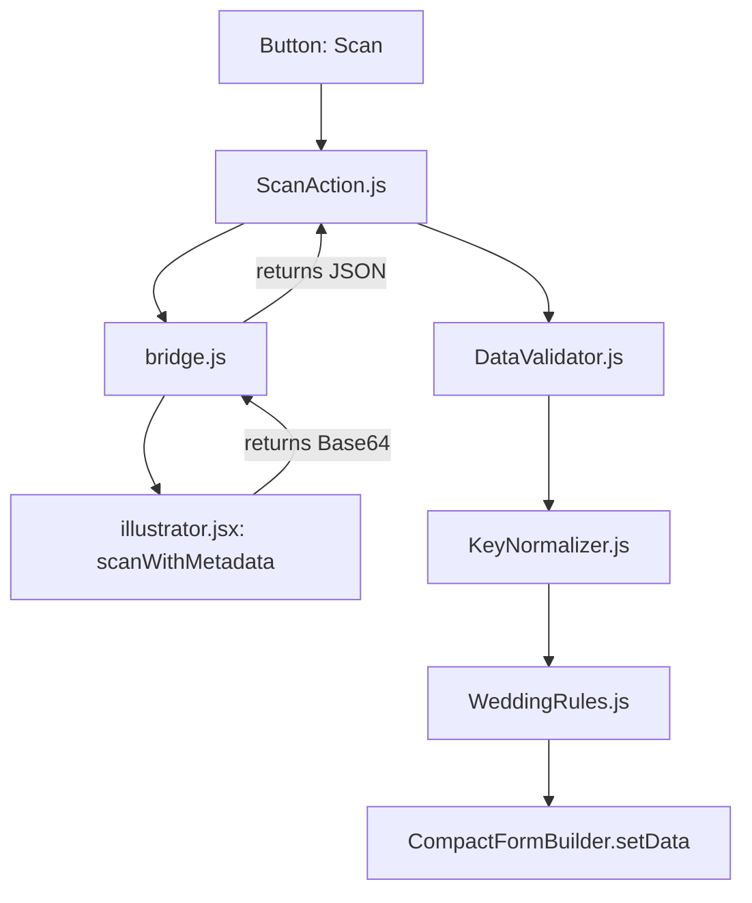
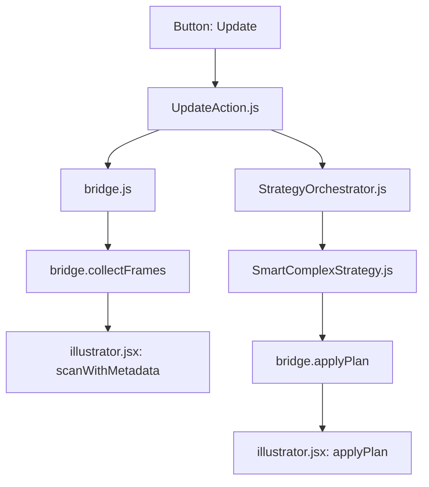
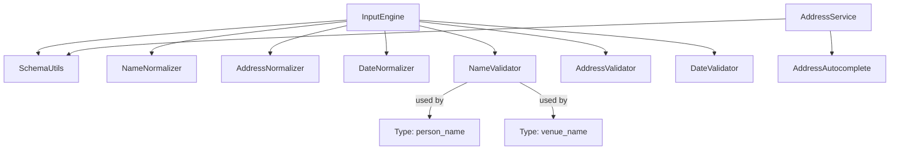

# 🧶 DEPENDENCY MAP

This map shows how modules interact across layers. Use this to assess the "Blast Radius" of any change.

## 🔄 Core Data Flow (Scan)

## 🔄 Core Data Flow (Update)

## 🧩 Logic Dependency Graph (UX Layer)

## 🏗️ Layer Dependencies (Hexagonal)
- **L7 Actions** depends on: L6 Controllers, L4 Pipeline, L0 Bridge
- **L6 Controllers** depends on: L4 Pipeline, L1 Domain, L3 UX-Components
- **L4 Pipeline** depends on: L1 Domain, L2 Logic
- **L1 Domain** depends on: nothing (PURE)
- **L0 Bridge** depends on: nothing (PURE CEP/JSX Interface)

## ⚠️ High-Risk Mediators
The following files are heavily connected and should be modified with caution:
1. **`js/bridge.js`**: Connects almost everything to JSX.
2. **`js/app.js`**: Composition root, wires all modules.
3. **`js/components/CompactFormBuilder.js`**: Manages the entire UI state.
